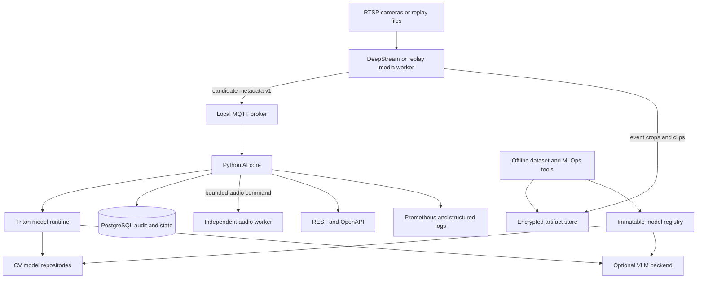
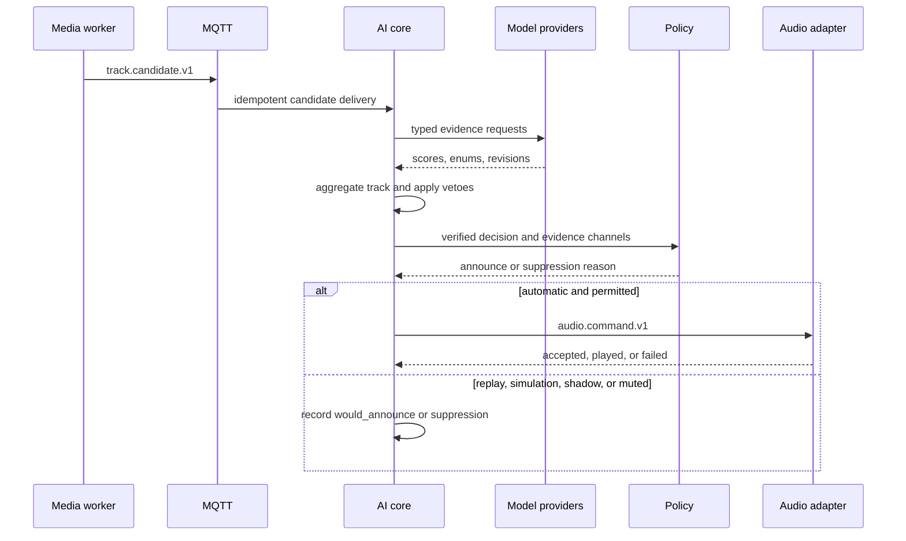
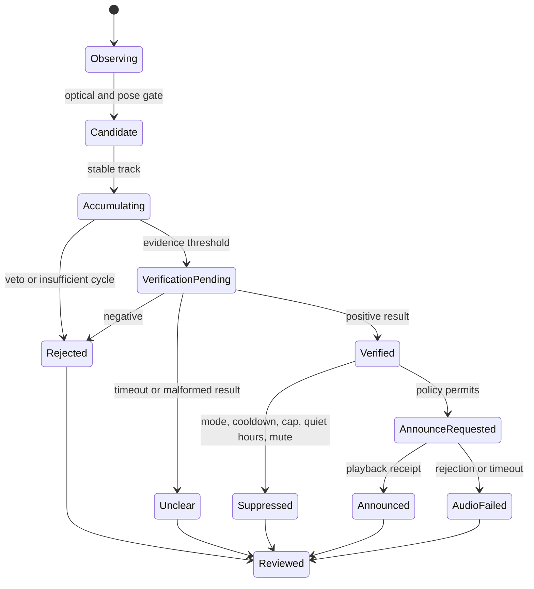
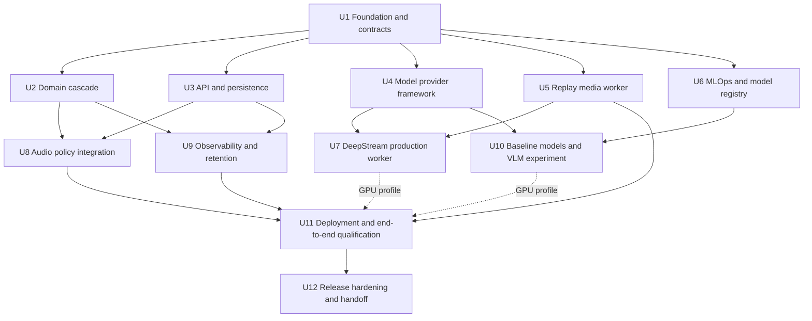

# On-Premise Smoking Detection AI Core - Plan

## Goal Capsule

- **Objective:** Deliver an operable, auditable on-premise AI core that can process 20 or more camera streams, suppress common false positives, and trigger neutral anti-smoking audio through a controlled integration.
- **Means:** Build a track-level cascade in a Python modular core, with native media ingestion and model runtimes behind versioned ports (KTD1, KTD2).
- **Authority:** `docs/draft.md` defines the requested product and stack. `docs/吸菸偵測方案研究/01-地端吸菸偵測方案評估.md` supplies the initial feasibility envelope. This plan owns implementation choices where those documents do not.
- **Execution profile:** GitFlow with short-lived feature branches, parallel worktrees after the contract foundation merges, and evidence recorded under `docs/dev_artifacts/`.
- **Stop conditions:** Stop model-dependent release work if model provenance, commercial rights, target-hardware support, or agency policy cannot be documented. Stop automatic audio rollout if the silent-mode acceptance gate is not met.
- **Tail ownership:** The TPM/PM owns ticket sequencing and acceptance. The tech lead owns contract changes and integration. Feature agents own only their assigned files and branch.

---

## Product Contract

### Summary

The product is the AI core and its API, not a complete video-management or public-address product. It receives live or replayed camera evidence, evaluates smoking behavior through independent evidence channels, records an auditable decision, and requests audio only when a conservative policy permits it.

### Problem Frame

A government site needs near-real-time smoking deterrence across more than 20 cameras on local compute. False announcements carry political and public-trust costs. The system must distinguish smoking from nose touching, betel-nut chewing, phone use, drinking, eating, pen or toothpick use, steam, and other hand-to-face behavior. Camera geometry and low-light conditions impose physical limits that more compute cannot remove.

### Key Decisions

- **Behavioral deterrence, not enforcement.** The system issues a neutral area-wide reminder and does not identify or accuse an individual. Governs R6, R10.
- **Track-level evidence, not frame-level alarms.** A single frame can create a candidate but cannot trigger audio. Governs R4, R5, R6.
- **Silent validation precedes automatic audio.** Production audio stays physically or operationally disabled until site data meets the acceptance gate. Governs R12.
- **Model provenance is a release gate.** A model or transitive dependency without documented origin and deployable license does not enter a government release. Governs R2, R11.

### Actors

- A1. **Site operator:** reviews events, labels outcomes, mutes audio, and inspects health.
- A2. **Camera/media worker:** converts RTSP or replay video into tracks and candidate evidence.
- A3. **AI core:** evaluates candidates, applies policy, persists decisions, and emits commands.
- A4. **Model runtime:** supplies detector, pose, classifier, chewing-veto, and optional VLM results.
- A5. **Audio controller:** accepts a bounded command and reports playback outcome.
- A6. **ML engineer:** curates local data, trains or calibrates models, and registers a release.
- A7. **Auditor/maintainer:** verifies provenance, configuration, metrics, retention, and change history.

### Requirements

**Deployment and capacity**

- R1. All inference and operational data processing must run on the site network without a required external connection.
- R2. Every production image, library, model, dataset, and weight must have machine-readable provenance and a documented license and origin decision.
- R3. The production profile must sustain at least 20 configured 1080p camera streams at the validated analysis frame rate without an unbounded queue.

**Detection and false-alarm control**

- R4. The AI core must evaluate a stable track identity through a staged cascade and preserve each stage result as structured evidence.
- R5. Audio eligibility must require temporal persistence and at least two independent positive evidence channels after all configured vetoes.
- R6. The decision policy must enforce per-zone cooldown, hourly and daily caps, quiet hours, manual mute, and automatic per-camera suspension after confirmed false announcements.
- R7. Camera profiles must define ROI polygons, excluded zones, optical eligibility limits, thresholds, and day/night behavior without code changes.
- R8. The classifier schema must represent named confusing behaviors rather than a smoking/background binary split.

**Interfaces and auditability**

- R9. The AI core must expose versioned health, configuration, evaluation, event, review, and model-registry APIs with generated schemas.
- R10. Each final decision must expose reason codes, evidence-channel summaries, configuration revision, model revisions, latency, and audio outcome without storing free-form model prose.
- R11. Each model role must be replaceable through a typed provider port so a prohibited or unsupported model can be removed without changing domain policy.
- R12. The system must support replay, simulation, shadow, human-confirmed, and automatic modes, with automatic mode guarded by an explicit site-level activation state.

**Privacy, operations, and takeover**

- R13. The service must not perform identity recognition, must not ingest microphone audio, and must apply separate configurable retention policies to raw media, event clips, and metadata.
- R14. Operators must be able to observe stream freshness, queue depth, stage latency, rejection reasons, model revisions, audio requests, and degraded-mode transitions.
- R15. A new coding agent must be able to locate contracts, run the CPU reference path, execute checks, claim a ticket, and record findings from repository instructions alone.

### Key Flows

- F1. **Live candidate to decision**
  - **Trigger:** A2 observes a stable person track that passes the optical and hand-to-mouth gates.
  - **Actors:** A2, A3, A4.
  - **Steps:** A2 publishes metadata-only candidate evidence; A3 accumulates track state; A4 supplies typed inference results; A3 records a verified, rejected, unclear, or errored decision.
  - **Outcome:** A decision exists with reason codes and reproducible revision references.
  - **Covered by:** R3, R4, R5, R8, R10, R11.
- F2. **Verified decision to announcement**
  - **Trigger:** A3 produces a smoking decision that satisfies the evidence rule.
  - **Actors:** A1, A3, A5.
  - **Steps:** A3 evaluates activation mode and policy limits; A5 accepts or rejects a bounded audio request; A3 records the outcome.
  - **Outcome:** At most one permitted neutral announcement occurs, or a structured suppression reason is recorded.
  - **Covered by:** R5, R6, R10, R12.
- F3. **Review to calibration evidence**
  - **Trigger:** A1 labels an event as true positive, false positive, false negative exercise, or unusable.
  - **Actors:** A1, A3, A6, A7.
  - **Steps:** A3 records an append-only review; exports create de-identified dataset manifests; A6 evaluates a candidate release against the sealed split; A7 approves or rejects promotion.
  - **Outcome:** Site evidence improves the system without silently rewriting past decisions.
  - **Covered by:** R2, R10, R12, R13.

### Acceptance Examples

- AE1. **Covers R4, R5, R8.** Given a track that touches the nose for one second with no object or smoking cycle, when the cascade evaluates it, then it records a pose or temporal rejection and never requests audio.
- AE2. **Covers R5, R8.** Given repeated betel-nut chewing and hand-to-mouth motion, when the chewing veto is positive, then the final decision is rejected even if the object classifier has a positive smoking score.
- AE3. **Covers R5, R6.** Given one apparent smoking cycle and no second independent channel, when policy evaluates the track, then it remains ineligible for audio.
- AE4. **Covers R6, R12.** Given a verified event in shadow mode, when policy approves the event, then the service records `would_announce` and sends no command to A5.
- AE5. **Covers R6.** Given an announcement in zone Z within the previous 600 seconds, when another eligible event occurs in Z, then the decision records `zone_cooldown` and no audio command is sent.
- AE6. **Covers R3, R14.** Given one stalled stream among 20 healthy streams, when its freshness deadline expires, then only that camera becomes degraded and health metrics identify its last good frame.
- AE7. **Covers R10, R11.** Given the primary VLM times out, when the fallback policy is `reject_on_unclear`, then the event records the timeout and model revision and no audio request is sent.
- AE8. **Covers R13.** Given an expired event clip and retained decision metadata, when the retention job runs, then the clip is deleted while the decision and deletion audit record remain.

### Success Criteria

- The CPU reference profile completes F1 through F3 with deterministic fake inference and a fake audio controller.
- The target-GPU benchmark sustains the agreed 20-camera profile for 24 hours with no process crash, no unbounded backlog, and no cross-camera failure propagation.
- Candidate-to-decision p95 latency, excluding the configured behavioral persistence window, is at most 8 seconds on the accepted hardware and model profile.
- The sealed site evaluation uses event-level metrics and meets the procurement target of precision at least 0.80 and recall at least 0.70 with one parameter set.
- The confusion suite reports a per-class trigger rate for betel nut, phone, drink, food, nose touching, pen/toothpick, steam, vape, and heated tobacco.
- A deployment bundle can be installed, started, diagnosed, backed up, restored, and handed to another coding agent from checked-in documentation.

### Scope Boundaries

**In scope**

- AI core API, domain cascade, policy engine, audit store, model-provider ports, replay path, live candidate ingress, deployment bundle, test harness, metrics, and agent documentation.
- A native DeepStream worker or validated equivalent for the target NVIDIA production profile.
- Dataset manifests, baseline training/evaluation scripts, model registry metadata, and a promotion gate.
- An audio-controller contract plus fake and site-adapter implementations.

**Deferred to Follow-Up Work**

- A full operator web UI; the API and generated OpenAPI document are the first operator surface.
- PTZ steering, air-quality sensors, thermal-camera fusion, multi-site federation, and HA across multiple servers.
- Automatic online learning; model changes use offline evaluation and explicit promotion.
- Vaping and heated-tobacco production acceptance until the agency supplies a written policy and labeled scenarios.

**Outside this product's identity**

- Face recognition, identity matching, punitive enforcement, evidentiary person identification, microphone recording, cloud inference, and public Internet dependencies.
- Replacement of the camera VMS or public-address system.

### Dependencies and Outstanding Questions

The plan is executable with deterministic providers. The following questions block only the affected production profile, not the CPU reference path:

- **Blocking for model release:** Which exact model families and transitive dependencies satisfy the agency's 2026 origin policy?
- **Blocking for automatic audio:** Are vape and heated tobacco in scope, what are quiet hours and volume limits, and who owns the appeal process?
- **Blocking for media retention:** What are the approved retention periods for raw recordings, event clips, thumbnails, and metadata?
- **Blocking for hardware procurement:** Does one L40S meet the measured profile with the chosen VLM, or is a second GPU required for isolation and failover?
- **Deferred:** The final camera-specific ROI, distance envelope, thresholds, and lighting profiles come from the site survey and silent period.

---

## Planning Contract

### Key Technical Decisions

- KTD1. **Use a modular monolith for the Python AI core.** One deployable owns the API, track state, policy, persistence coordination, and audit behavior. Internal domain, application, port, and adapter packages keep these concerns separable without operational microservice overhead.
- KTD2. **Keep video and GPU model runtimes out of the Python core process.** DeepStream 9.1 owns RTSP, NVDEC, batching, detector inference, and tracking. Use Service Maker Python for pipeline configuration and control, with a custom C++ plugin only when the hot path or typed metadata requires it. Triton owns gated crop and verification models. Versioned events and provider clients isolate their failure and memory cycles.
- KTD3. **Use MQTT for metadata events and an artifact store for media.** The live worker publishes small QoS messages that contain artifact IDs, never image bytes or arbitrary paths. A local filesystem adapter serves a single node first; an S3-compatible adapter remains possible later.
- KTD4. **Make the domain cascade deterministic and provider-neutral.** The domain accepts observations and inference results and owns S3 aggregation, S4 cycles, veto precedence, evidence independence, and S6 policy. Model adapters do not decide whether audio is allowed.
- KTD5. **Use PostgreSQL for production state and SQLite only for isolated tests.** Append-only decision and review records need concurrency, migrations, retention jobs, and reliable operational queries.
- KTD6. **Use FastAPI, Pydantic settings/models, and generated OpenAPI for the service edge.** Pin Python versions in U1. Pin the production GPU image to the verified DeepStream 9.1 compatibility row: Ubuntu 24.04, CUDA 13.2, TensorRT 10.16.0.72, and driver R595.58.03. Treat any stack update as an engine rebuild and qualification event.
- KTD7. **Treat VLM verification as optional and fail-closed.** A timeout, malformed output, or `unclear` cannot create positive evidence. Production compares `with_vlm` and `without_vlm` profiles before accepting the regulatory and runtime cost.
- KTD8. **Start with a replay-first vertical slice.** Recorded clips and deterministic providers prove contracts and policy before RTSP, GPU, and model availability can obscure domain defects.
- KTD9. **Store structured model outputs only.** A provider returns a constrained enum, calibrated score where supported, reason code, timing, and revision. Generated prose is not a control input and is not stored in operator-visible records.
- KTD10. **Promote immutable model releases through an on-premise MLflow registry.** A release contains hashes, parent checkpoints, origin, license, dataset manifest, evaluation report, calibration, runtime requirements, and rollback target. MLflow aliases such as `candidate`, `champion`, and `rollback` may point to an immutable version, but an alias never identifies an audit record.
- KTD11. **Adopt L40S as the production baseline and RTX 5090 as development or explicitly accepted pilot hardware.** Start proof-of-capacity on one L40S. Prefer two L40S devices for production so GPU0 isolates DeepStream CV from Triton/VLM on GPU1. A single-GPU profile must publish memory ceilings and prove that verifier bursts cannot starve decode.
- KTD12. **Bake off a clean-lineage model stack before a conditional NVIDIA-derived stack.** The first candidate set is PeopleNet Transformer or RF-DETR M/L, MediaPipe Pose/Hand or RF-DETR Keypoint, and SigLIP 2. VLM challengers are Phi-4-multimodal, Gemma 4 12B, Pixtral 12B, and Liquid LFM2-VL. TAO RT-DETR Warehouse and Cosmos Reason2 remain conditional because publisher identity does not erase architecture or parent-checkpoint ancestry.

### High-Level Technical Design

#### Component and trust boundaries



The camera network, GPU host, broker, database, artifact store, and audio adapter stay on the closed site network. Only metadata crosses MQTT. The core rejects references outside the registered artifact root.

#### Candidate-decision sequence



#### Decision lifecycle



#### Service boundaries

| Boundary | Owns | Must not own |
|---|---|---|
| `smoke-core` | API, orchestration, cascade state, policy, audit, retention coordination | RTSP decode, unrestricted model code, speaker device drivers |
| `media-worker` | RTSP/replay decode, sampling, detection/tracking, crops, candidate publication | Audio policy, operator reviews, final smoking decision |
| `triton-runtime` | Dynamic batching, bounded queues, model loading, inference, metrics, and version receipts | Cross-stage policy or direct persistence writes |
| `audio-worker` | Fixed hashed WAV catalog, ALSA or site-protocol translation, dedupe, expiry, and playback receipt | Deciding whether an event is smoking or accepting arbitrary audio text |
| `ml` toolchain | Dataset manifests, training, evaluation, calibration, MLflow registration, release packaging | Automatic production promotion |

### Interface Contracts

All timestamps use UTC RFC 3339. Identifiers are opaque strings. Every event includes `schema_version`, `event_id`, `correlation_id`, `producer`, and `occurred_at`. Consumers must be idempotent on `event_id`.

#### `track.candidate.v1`

Required fields are `camera_id`, `track_id`, `camera_config_revision`, `source_pts_ns`, `capture_ts_ns`, `received_ts_ns`, `first_seen_at`, `last_seen_at`, `stage`, `artifact_ids`, `geometry`, `quality`, and `observations`. `quality` includes source dimensions, face pixels, crop pixels, illumination profile, and an eligibility reason. `observations` contains typed pose, object, smoke, hotspot, and temporal facts. Raw pixels are never embedded. The three timestamps let replay and audit separate source delay, transport delay, queue delay, and inference delay.

#### `decision.completed.v1`

Required fields are `decision_id`, `camera_id`, `track_id`, `outcome`, `reason_codes`, `evidence_channels`, `model_revisions`, `policy_revision`, `latency_ms`, `mode`, and `audio_eligibility`. `outcome` is one of `verified`, `rejected`, `unclear`, or `error`. Reason codes come from a versioned enum.

#### `audio.command.v1`

Required fields are `command_id`, `decision_id`, `zone_id`, `message_id`, `volume_profile`, `expires_at`, and `policy_revision`. The adapter receives a message catalog ID, never arbitrary text or a filesystem path.

#### REST API v1

| Method and path | Purpose | Notes |
|---|---|---|
| `GET /health/live` | Process liveness | Does not depend on models |
| `GET /health/ready` | Dependency and model readiness | Returns component-level degradation |
| `GET /v1/capabilities` | Active stages, modes, schemas, model roles | No secrets or model file paths |
| `GET /v1/cameras` | List effective camera profiles | Includes revision and coverage state |
| `PUT /v1/cameras/{camera_id}` | Validate and stage a camera profile | Activation is a separate audited action |
| `POST /v1/artifacts` | Upload bounded replay/evaluation media | Disabled by default in production |
| `POST /v1/evaluations` | Start replay or artifact evaluation | Returns an asynchronous evaluation ID |
| `GET /v1/evaluations/{evaluation_id}` | Read progress and result | Stable polling contract |
| `GET /v1/events` | Query decisions by time, camera, outcome, or reason | Paginated; authorization deferred to deployment boundary |
| `POST /v1/events/{decision_id}/reviews` | Append an operator label | Does not mutate original evidence |
| `POST /v1/site-mode` | Change simulation, shadow, human-confirmed, or automatic mode | Requires reason and actor audit fields |
| `POST /v1/audio/mute` | Apply site, zone, or camera mute | Does not provide arbitrary playback |
| `GET /v1/models` | List immutable model releases and active roles | Includes hashes and provenance status |

### Output Structure

```text
.
├── AGENTS.md
├── pyproject.toml
├── uv.lock
├── proto/
│   └── smoke/v1/
│       ├── candidate.proto
│       ├── decision.proto
│       └── audio.proto
├── schemas/
│   └── smoke/v1/
├── src/tp_smoke_detect/
│   ├── api/
│   ├── application/
│   ├── domain/
│   │   ├── cascade/
│   │   ├── models/
│   │   └── policy/
│   ├── ports/
│   ├── adapters/
│   │   ├── artifacts/
│   │   ├── audio/
│   │   ├── inference/
│   │   ├── messaging/
│   │   └── persistence/
│   ├── observability/
│   └── settings.py
├── native/deepstream/
│   ├── CMakeLists.txt
│   ├── include/
│   ├── src/
│   └── tests/
├── ml/
│   ├── configs/
│   ├── datasets/
│   ├── evaluation/
│   ├── training/
│   └── registry/
├── model_repository/
│   ├── crop_classifier/
│   └── verifier/
├── configs/
│   ├── cameras.example.yaml
│   ├── policies.example.yaml
│   └── models.example.yaml
├── deploy/
│   ├── compose.yaml
│   ├── Dockerfile.core
│   ├── Dockerfile.media
│   ├── Dockerfile.audio
│   ├── mlflow/
│   └── prometheus/
├── scripts/
├── tests/
│   ├── contract/
│   ├── e2e/
│   ├── integration/
│   ├── load/
│   └── unit/
└── docs/
    ├── runbooks/
    └── dev_artifacts/
        ├── decisions/
        ├── memory/
        ├── progress/
        ├── research/
        ├── reviews/
        └── tickets/
```

### Configuration and Revision Rules

- Camera, policy, prompt, and model configurations have immutable content hashes and human-readable revision IDs.
- Secrets enter through mounted files or a deployment secret store and never appear in YAML examples, API responses, logs, or artifacts.
- A configuration change validates first, records an audit entry, and activates atomically.
- Runtime defaults are safe: simulation mode, audio muted, `reject_on_unclear`, bounded queues, and no remote URL fetching.
- The core starts without GPU dependencies when deterministic providers are selected.

### GitFlow and Artifact Discipline

- `main` contains released code only. `develop` is the canonical integration branch.
- Each ticket uses `feature/<ticket-id>-<slug>` from the current remote `develop` and a dedicated worktree when it can run independently.
- The tech lead owns schema and migration changes after U1. A worker that needs a contract change proposes it before editing shared contract files.
- Each accepted ticket pushes its branch to the remote and opens or updates a review against `develop`. The integration owner pushes `develop` after each merge.
- Release hardening occurs on `release/<version>` and merges into both `main` and `develop`. Production fixes use `hotfix/<slug>` from `main` and merge back to both branches.
- Every ticket writes a concise result under `docs/dev_artifacts/tickets/<ticket-id>.md`. Research goes under `research/`; reviews under `reviews/`; reusable problem/solution notes under `memory/`.
- Memory notes use: context, symptom, discarded hypotheses, root cause, fix, verification, prevention, and related commit. Do not store credentials, private video, or person-identifying screenshots.

### Load-Bearing 2026 Research Conclusions

- Use DeepStream 9.1 as the high-rate media plane and Triton as the gated model plane. Keep temporal state and alert policy in Python. This follows `docs/dev_artifacts/research/2026-08-24-onprem-video-analytics-architecture.md`.
- An L40S official DeepStream result provides useful headroom for 20 cameras, but it is detector evidence rather than an end-to-end guarantee. The project must benchmark the exact stack and streams.
- Every queue needs a limit, an age budget, a drop policy, and an owner. Decode keeps recent frames; candidate transitions are deduplicated; VLM overload yields `review_unavailable` and no audio.
- TensorRT engines are hardware and runtime specific. Engine identity includes CUDA, TensorRT, GPU compute capability, calibration, ONNX, and weight hashes.
- The clean-lineage model bakeoff starts with PeopleNet Transformer or RF-DETR M/L, MediaPipe or RF-DETR keypoints, and SigLIP 2. The optional verifier bakeoff compares Phi-4-multimodal, Gemma 4 12B, Pixtral 12B, and Liquid LFM2-VL.
- TAO RT-DETR Warehouse and Cosmos Reason2 are conditional choices. Cosmos Reason2 model cards identify Qwen3-VL parent checkpoints, so an NVIDIA publisher label is not a clean ancestry conclusion. This follows `docs/dev_artifacts/research/2026-08-24-model-pipeline-survey.md`.
- Audio runs in its own least-privilege container with the sound device and fixed hashed WAV files. GPU analytics never receives `/dev/snd`.

### Remaining Research Questions Requiring Current-2026 Evidence

| ID | Question | Suggested agent | Required evidence | Blocks |
|---|---|---|---|---|
| RQ1 | Do the exact shortlisted code, weight, dataset, and container artifacts satisfy the agency's origin rule? | Luna provenance researcher | Parent-checkpoint chain, transitive SBOM, hashes, license files, and human procurement disposition | Production model profile |
| RQ2 | Which exact Python, FastAPI, Pydantic, PyTorch, ONNX Runtime, Triton backend, and client versions coexist with the verified DeepStream 9.1 GPU image? | Luna framework researcher | Official compatibility matrices plus a build-and-import receipt | GPU image and lockfile pins |
| RQ3 | Does Service Maker Python carry all required metadata at the target rate, or does candidate extraction require a custom C++ plugin? | Luna NVIDIA implementation researcher | One-stream and 20-stream profiling with metadata-integrity tests | U7 final hot-path shape |
| RQ4 | On L40S and the candidate professional Blackwell card, what throughput, VRAM, latency, NVDEC capacity, and 24/7 support apply to the proposed stack? | Luna hardware researcher | Vendor documentation plus rented-hardware benchmark plan | Hardware procurement |
| RQ5 | Do Gemma 4 12B, Pixtral 12B, Phi-4-multimodal, and Liquid LFM2-VL accept the required crop/video inputs through the selected Triton backend with strict structured output? | Luna model researcher | Build receipt, schema compliance, license, latency, VRAM high-water mark, and failure behavior | Optional VLM profile |
| RQ6 | Which Taiwan government rules govern model ancestry, AI risk assessment, personal-data retention, signage, and public audio in August 2026? | Luna legal-source researcher with human legal review | Primary government sources and agency legal sign-off | Government release and procurement text |
| RQ7 | Which datasets can be downloaded and redistributed for cigarette, vaping, hand-object, pose, smoke, and hard-negative training? | Luna dataset researcher | Dataset cards, original licenses, provenance, class counts, and download hashes | External-data training |
| RQ8 | Can the site operate without a VLM while meeting the false-announcement budget? | Sol experiment owner | Pre-registered with/without-VLM event-level evaluation on the same sealed clips | VLM adoption decision |

The completed surveys narrow the option set but do not certify a release. Until the remaining gates produce artifact-level receipts, adapters use deterministic providers and model names remain configuration examples rather than committed dependencies.

### Assumptions

- The first deliverable targets one on-premise GPU host and one government site.
- Existing cameras expose stable RTSP streams and the site supplies credentials through deployment secrets.
- PostgreSQL, MQTT, and the artifact store can run on the same host for the pilot.
- The public-address system offers one documented local protocol or accepts a small site-specific adapter.
- An operator can review events during the silent period.
- The agency will provide written policy decisions before automatic audio activation.

### System-Wide Impact

- **Privacy:** Crops and clips are personal data even without identity recognition. Retention, access, exports, and review tooling must use the same audit boundary.
- **Availability:** A VLM or one camera may fail without stopping other streams or the CPU decision service. Queue bounds and per-camera circuit breakers are required.
- **Security:** RTSP credentials, arbitrary file access, model downloads, and message replay are the principal attack surfaces in the initial deployment.
- **Governance:** Model hashes, decision reasons, silent-mode reports, confusion-class results, and configuration revisions are part of the deliverable, not optional diagnostics.
- **Agent parity:** Every routine developer action must be available through repository commands and documented contracts. No critical workflow may exist only in one operator's shell history.

### Risks and Mitigations

| Risk | Impact | Mitigation and owner |
|---|---|---|
| Site video lacks enough pixels for hands or cigarettes | Unrecoverable recall loss | Survey every camera and enforce the optical eligibility gate; TPM owns published coverage envelope |
| Betel-nut and local behaviors have no adequate public data | Politically salient false alarms | Collect site negatives from day one and require a dedicated confusion report; ML lead owns dataset coverage |
| Model or dependency provenance fails procurement review | Release blocked or forced replacement | Immutable release manifests, SBOM, dual model profile, and RQ1/RQ6 gates; tech lead and legal owner |
| VLM OOM or timeout harms the real-time path | Missed events or total outage | Separate process/GPU budget, bounded timeout, fail-closed response, and optional no-VLM profile |
| Audio adapter repeats or accepts stale commands | Public nuisance | Idempotency key, expiry, zone cooldown, adapter-side rate cap, physical mute, and playback receipt |
| Parallel agents change shared schemas independently | Integration churn | Freeze v1 contracts in U1; tech lead owns later contract changes and merge order |
| Training data leaks identifying media | Privacy incident | Local-only data store, manifest IDs instead of paths, retention enforcement, access logs, and no artifacts in Git |
| Metrics look good because unusable periods are excluded | Misleading acceptance | Report stream uptime and optical eligibility beside precision and recall |

### Recommended Sequencing and Parallelization

#### Delivery envelope

- **MVP-0, executable in the current repository and CPU environment:** U1-U6, U8, U9, the CPU/replay portion of U11, and U12 documentation. It delivers a real FastAPI service, PostgreSQL audit store, deterministic cascade, replay ingestion, fake model and audio providers, metrics, retention, Compose deployment, and an agent takeover path. It does not claim live 20-camera capacity, trained-model accuracy, or automatic public audio.
- **MVP-1, GPU-lab gated:** U7, U10, and the GPU qualification portion of U11. It delivers DeepStream/Triton integration, baseline model artifacts, the VLM ablation, and a 20-stream replay report. It requires a compatible GPU, downloadable approved weights/data, and the RQ1-RQ5 receipts.
- **Pilot and production activation, site gated:** U12 release qualification plus camera survey, local hard-negative data, silent operation, agency policy, retention approval, audio-device integration, and legal/procurement sign-off. Automatic audio is a configuration activation after evidence, not an MVP-0 promise.
- **Budget policy:** Luna agents own all research and implementation tickets. Sol owns architecture, ticket acceptance criteria, integration decisions, and final code/document review only.



After U1 merges, use three concurrent lanes:

1. **Core lane:** U2 then U8, with U3 parallel to U2.
2. **Media/runtime lane:** U4 and U5 in parallel, then U7.
3. **Data/operations lane:** U6, then U10; U9 begins when U2 and U3 contracts settle.

U11 may merge its CPU profile after U5, U8, and U9. Its GPU qualification remains blocked on U7 and U10. Do not parallelize final U11 integration or U12. Sol performs the final review after Luna completes each integration gate.

---

## Implementation Units

| U-ID | Title | Primary files | Depends on |
|---|---|---|---|
| U1 | Repository foundation and v1 contracts | `pyproject.toml`, `AGENTS.md`, `proto/smoke/v1/` | None |
| U2 | Deterministic domain cascade | `src/tp_smoke_detect/domain/` | U1 |
| U3 | API, persistence, and audit | `src/tp_smoke_detect/api/`, `adapters/persistence/` | U1 |
| U4 | Model-provider framework | `src/tp_smoke_detect/ports/inference.py`, `adapters/inference/` | U1 |
| U5 | Replay media worker | `src/tp_smoke_detect/application/replay.py` | U1 |
| U6 | Dataset, evaluation, and registry contracts | `ml/` | U1 |
| U7 | DeepStream production media worker | `native/deepstream/` | U4, U5 |
| U8 | Audio policy and adapter integration | `domain/policy/`, `adapters/audio/` | U2, U3 |
| U9 | Observability, retention, and degraded modes | `observability/`, `application/retention.py` | U2, U3 |
| U10 | Baseline model and VLM ablation | `ml/training/`, `ml/evaluation/` | U4, U6 |
| U11 | Deployment and end-to-end qualification | `deploy/`, `tests/e2e/`, `tests/load/` | U5, U8, U9; GPU profile also U7, U10 |
| U12 | Release hardening and agent handoff | `docs/runbooks/`, `docs/dev_artifacts/` | U11 |

### U1. Repository foundation and v1 contracts

- **Goal:** Create the Python project, quality gates, agent instructions, schemas, and configuration skeleton that every lane shares.
- **Requirements:** R2, R9, R15.
- **Dependencies:** None.
- **Files:** `pyproject.toml`, `uv.lock`, `AGENTS.md`, `src/tp_smoke_detect/__init__.py`, `src/tp_smoke_detect/settings.py`, `proto/smoke/v1/candidate.proto`, `proto/smoke/v1/decision.proto`, `proto/smoke/v1/audio.proto`, `schemas/smoke/v1/`, `configs/*.example.yaml`, `tests/contract/test_schema_compatibility.py`, `tests/unit/test_settings.py`.
- **Approach:** Pin a minimal CPU dependency group and separate `gpu`, `dev`, and `ml` groups. Generate JSON Schema from the canonical typed contracts. Document branch ownership, artifact conventions, private-media rules, and standard commands in `AGENTS.md`.
- **Execution note:** Prove installation and schema generation before adding feature behavior.
- **Patterns to follow:** Python packaging through `uv`; Pydantic validation; conventional commits; no secret-bearing defaults.
- **Test scenarios:**
  - A clean CPU environment resolves and imports the package without CUDA libraries.
  - Invalid camera polygons, negative limits, and unknown modes fail settings validation with field-level errors.
  - Generated event schemas remain backward compatible with checked-in v1 fixtures.
  - `AGENTS.md` directs a new agent to the same build, lint, test, and artifact commands used by CI.
- **Verification:** A fresh checkout can install the CPU profile, validate example configuration, generate identical schemas, and run contract tests.

### U2. Deterministic domain cascade

- **Goal:** Implement provider-neutral track aggregation, stage transitions, veto precedence, cycle detection, evidence independence, and final decision reasons.
- **Requirements:** R4, R5, R8, R10, R11; F1; AE1, AE2, AE3, AE7.
- **Dependencies:** U1.
- **Files:** `src/tp_smoke_detect/domain/models/`, `src/tp_smoke_detect/domain/cascade/`, `src/tp_smoke_detect/domain/policy/evidence.py`, `tests/unit/domain/test_track_state.py`, `tests/unit/domain/test_cycle_detector.py`, `tests/unit/domain/test_vetoes.py`, `tests/unit/domain/test_evidence_policy.py`.
- **Approach:** Model observations and transitions as pure functions over explicit timestamps. Make vetoes dominant, make positive channels named, and keep thresholds in revisioned policy input rather than globals.
- **Execution note:** Implement the domain rules test-first with virtual time and table-driven confusion scenarios.
- **Test scenarios:**
  - Covers AE1. A nose-touch observation never forms a mouth-contact cycle.
  - Covers AE2. A positive chewing veto overrides positive object evidence.
  - Covers AE3. One positive channel or one cycle cannot reach `verified`.
  - Out-of-order duplicate observations do not double-count a cycle.
  - A track gap beyond the configured tolerance closes the old state rather than joining a new person.
  - Covers AE7. Missing or malformed optional VLM evidence resolves to `unclear` or rejection according to policy, never positive evidence.
- **Verification:** Property and table-driven tests show deterministic outcomes independent of message retries and wall-clock speed.

### U3. API, persistence, and audit

- **Goal:** Expose the v1 service surface and persist immutable decisions, reviews, configurations, and model references.
- **Requirements:** R9, R10, R12, R13; F3; AE4, AE8.
- **Dependencies:** U1.
- **Files:** `src/tp_smoke_detect/api/`, `src/tp_smoke_detect/application/`, `src/tp_smoke_detect/ports/repositories.py`, `src/tp_smoke_detect/adapters/persistence/`, `tests/unit/api/test_validation.py`, `tests/integration/test_api_database.py`, `tests/contract/test_openapi.py`.
- **Approach:** Keep routes thin and call application use cases. Use migrations for PostgreSQL. Record reviews and mode changes as append-only facts. Reject remote URLs and paths outside the artifact port.
- **Execution note:** Start with failing API/database integration tests for the v1 contracts.
- **Test scenarios:**
  - A valid replay evaluation returns an ID and reaches a terminal result through polling.
  - Invalid media type, oversized upload, unknown camera, and path traversal are rejected before persistence.
  - Covers AE4. Shadow mode records `would_announce` without creating an audio command.
  - Two reviews append two audit records and do not rewrite the original decision.
  - Covers AE8. Metadata remains queryable after the artifact record is marked deleted.
  - Repeating an idempotent request returns the prior result without duplicate decisions.
- **Verification:** OpenAPI is stable, migrations apply to an empty database, and integration tests prove API-to-database behavior.

### U4. Model-provider framework

- **Goal:** Define model-role ports and deterministic, ONNX/TensorRT, and OpenAI-compatible adapter boundaries.
- **Requirements:** R2, R8, R10, R11; F1; AE7.
- **Dependencies:** U1.
- **Files:** `src/tp_smoke_detect/ports/inference.py`, `src/tp_smoke_detect/adapters/inference/fake.py`, `src/tp_smoke_detect/adapters/inference/onnx.py`, `src/tp_smoke_detect/adapters/inference/openai_compatible.py`, `src/tp_smoke_detect/application/model_router.py`, `tests/contract/test_inference_providers.py`, `tests/unit/adapters/test_fake_inference.py`, `tests/integration/test_model_timeout.py`.
- **Approach:** One typed port per model role shares a common receipt envelope. Enforce timeouts, batch limits, constrained enums, revision capture, and circuit breakers at the adapter boundary.
- **Test scenarios:**
  - Every provider passes the same role-specific contract suite.
  - A timeout, OOM response, malformed enum, NaN score, and revision mismatch fail closed.
  - A deterministic fixture produces the same receipt across repeated runs.
  - Provider degradation does not make health liveness fail, but readiness identifies the unavailable role.
- **Verification:** The core can swap fake and real providers through configuration without domain or API changes.

### U5. Replay media worker

- **Goal:** Convert recorded clips and image sequences into deterministic candidate events and artifacts for development and qualification.
- **Requirements:** R4, R7, R12, R15; F1.
- **Dependencies:** U1.
- **Files:** `src/tp_smoke_detect/application/replay.py`, `src/tp_smoke_detect/adapters/artifacts/local.py`, `src/tp_smoke_detect/adapters/messaging/in_memory.py`, `scripts/replay_fixture.py`, `tests/unit/test_replay_sampling.py`, `tests/integration/test_replay_candidate_flow.py`, `tests/fixtures/media/README.md`.
- **Approach:** Use a fixed-time sampling clock and registered fixture manifests. Produce the same candidate envelope as the live worker. Keep private site media outside Git and provide synthetic or redistributable smoke fixtures only.
- **Test scenarios:**
  - A clip sampled at 5 fps produces stable timestamps and no duplicate frame IDs.
  - A corrupt frame, truncated clip, and unsupported codec produce structured errors without terminating other evaluations.
  - ROI exclusion prevents candidates outside the configured polygon.
  - Replaying the same fixture twice yields byte-equivalent candidate metadata apart from correlation IDs.
- **Verification:** One command drives a fixture through candidate creation without a GPU or broker.

### U6. Dataset, evaluation, and registry contracts

- **Goal:** Establish reproducible local datasets, event-level evaluation, calibration, and immutable model-release manifests.
- **Requirements:** R2, R8, R10, R12, R13; F3.
- **Dependencies:** U1.
- **Files:** `ml/datasets/`, `ml/evaluation/`, `ml/registry/`, `ml/configs/`, `tests/unit/ml/test_manifest.py`, `tests/unit/ml/test_event_metrics.py`, `tests/unit/ml/test_release_manifest.py`.
- **Approach:** Store content hashes and metadata in Git, not media. Split by camera and track to prevent leakage. Report event-level precision, recall, per-confusion trigger rates, calibration curves, coverage eligibility, and latency.
- **Test scenarios:**
  - Two frames from one track cannot land in different train and sealed-test splits.
  - A dataset with an unknown license or missing source hash cannot enter a release manifest.
  - Event aggregation counts one continuous 120-second session once.
  - Empty classes, no-positive sets, and unusable clips produce explicit metric states rather than misleading zeros.
  - A promoted model manifest includes hashes, runtime profile, calibration, provenance, and rollback target.
- **Verification:** A small public fixture dataset generates a deterministic report and a validation-ready, non-production model manifest.

### U7. DeepStream production media worker

- **Goal:** Implement the 20-camera RTSP, decode, sampling, detector/tracker, crop, and candidate-publication path on NVIDIA hardware.
- **Requirements:** R1, R3, R4, R7, R14; F1; AE6.
- **Dependencies:** U4, U5, RQ2, RQ3.
- **Files:** `native/deepstream/CMakeLists.txt`, `native/deepstream/include/`, `native/deepstream/src/`, `native/deepstream/tests/`, `deploy/Dockerfile.media`, `tests/contract/fixtures/candidate/`.
- **Approach:** Implement the native pipeline in C++ and emit the U1 contract. Use bounded per-camera queues, reconnect backoff, per-stream health, and artifact writes outside the message broker. Match replay semantics for timestamps, ROI, quality gates, and IDs.
- **Execution note:** Establish one-stream runtime smoke proof before multiplexing 20 streams.
- **Test scenarios:**
  - One valid RTSP stream publishes candidate envelopes compatible with U1 fixtures.
  - Covers AE6. One stalled or malformed stream degrades independently while healthy streams continue.
  - Broker outage applies a bounded retry policy and does not exhaust host memory.
  - Day/night profile changes follow the configured signal and preserve the active revision in events.
  - Twenty replayed 1080p streams hold the chosen analysis rate and bounded queue for the qualification duration.
- **Verification:** Target-hardware smoke and load reports record versions, throughput, VRAM, queue depth, dropped samples, and per-stream recovery.

### U8. Audio policy and adapter integration

- **Goal:** Convert eligible verified decisions into safe, idempotent audio commands and record every suppression or playback outcome.
- **Requirements:** R5, R6, R10, R12; F2; AE3, AE4, AE5.
- **Dependencies:** U2, U3.
- **Files:** `src/tp_smoke_detect/domain/policy/audio.py`, `src/tp_smoke_detect/ports/audio.py`, `src/tp_smoke_detect/adapters/audio/fake.py`, `src/tp_smoke_detect/adapters/audio/http.py`, `src/tp_smoke_detect/application/request_audio.py`, `tests/unit/domain/test_audio_policy.py`, `tests/contract/test_audio_adapter.py`, `tests/integration/test_decision_to_audio.py`.
- **Approach:** The core selects a catalog message ID only after policy passes. The adapter enforces idempotency and expiry again. Manual mute and automatic suspension have higher precedence than all positive evidence.
- **Execution note:** Prove all suppression paths before allowing a fake successful playback.
- **Test scenarios:**
  - Covers AE3. Insufficient evidence produces no command.
  - Covers AE4. Shadow mode records a simulated outcome without calling the adapter.
  - Covers AE5. Zone cooldown suppresses a second command while another zone remains eligible.
  - Quiet hours, hourly cap, daily cap, manual mute, and false-announcement suspension each return distinct reason codes.
  - Repeated delivery of one command creates at most one playback receipt.
  - An expired command or unknown message ID is rejected by the adapter.
- **Verification:** Integration tests prove no route can bypass policy to invoke arbitrary audio.

### U9. Observability, retention, and degraded modes

- **Goal:** Make operational health, false-alarm behavior, data lifecycle, and partial failure observable and controllable.
- **Requirements:** R10, R13, R14; AE6, AE8.
- **Dependencies:** U2, U3.
- **Files:** `src/tp_smoke_detect/observability/`, `src/tp_smoke_detect/application/retention.py`, `src/tp_smoke_detect/application/health.py`, `deploy/prometheus/`, `tests/unit/test_retention.py`, `tests/integration/test_metrics.py`, `tests/integration/test_degraded_modes.py`.
- **Approach:** Use low-cardinality Prometheus metrics, structured logs with correlation IDs, and explicit component readiness. Apply separate deletion schedules and durable deletion audits.
- **Test scenarios:**
  - Covers AE6. A camera freshness breach changes only that camera's readiness and metric labels.
  - Covers AE8. Each media class expires on its own clock while retained metadata stays consistent.
  - Metrics avoid track IDs, decision IDs, and raw camera URLs as labels.
  - Database, broker, model, artifact-store, and audio failures produce distinct degraded states.
  - A retention retry is idempotent after partial filesystem or database failure.
- **Verification:** Dashboards and API readiness can identify the failed component, affected camera count, backlog, and last successful activity.

### U10. Baseline model and VLM ablation

- **Goal:** Train or configure the first lawful baseline and measure whether optional VLM verification materially improves event-level false-alarm performance.
- **Requirements:** R2, R3, R5, R8, R11, R12; RQ1, RQ4, RQ5, RQ7, RQ8.
- **Dependencies:** U4, U6.
- **Files:** `ml/training/`, `ml/evaluation/ablation.py`, `ml/configs/baseline/`, `ml/registry/releases/`, `tests/unit/ml/test_calibration.py`, `tests/integration/ml/test_baseline_export.py`, `docs/dev_artifacts/research/`.
- **Approach:** Begin with frozen embeddings plus named-class head and rule-based cycles. Compare the same sealed events with VLM disabled and enabled. Record crop-resolution ablations before model-family conclusions. Promote no artifact without the U6 manifest gate.
- **Execution note:** Keep the sealed evaluation set untouched until the pre-registered configurations are fixed.
- **Test scenarios:**
  - Calibration selects thresholds from training/validation data without reading sealed labels.
  - Full-frame, person-crop, head/shoulder-crop, and hand/face-crop variants generate comparable reports.
  - With/without-VLM runs use identical candidate events and report confidence intervals.
  - Exported artifacts load through U4 and reproduce reference outputs within the documented tolerance.
  - A license, origin, runtime, or checksum failure blocks promotion.
- **Verification:** The artifact folder contains a reproducible benchmark report, decision on VLM adoption, model card, provenance record, and rollback-compatible release.

### U11. Deployment and end-to-end qualification

- **Goal:** Assemble the air-gapped deployment and prove the full replay and target-hardware profiles under load and failure.
- **Requirements:** R1 through R14; F1, F2, F3.
- **Dependencies:** U5, U8, and U9 for the CPU/replay MVP. U7, U10, and RQ4 are additional dependencies for the GPU production profile.
- **Files:** `deploy/compose.yaml`, `deploy/Dockerfile.core`, `deploy/Dockerfile.media`, `deploy/prometheus/`, `scripts/healthcheck.py`, `scripts/backup_restore.py`, `tests/e2e/`, `tests/load/`, `docs/dev_artifacts/reviews/`.
- **Approach:** Pin images by digest, run as non-root, mount secrets read-only, bound resources, and define start order through readiness. Qualify CPU replay first, then one GPU stream, then the 20-stream profile, then fault injection.
- **Test scenarios:**
  - A clean offline host starts from a preloaded bundle without reaching the Internet.
  - F1 through F3 complete through broker, database, artifact store, fake/real providers, and fake audio.
  - Broker restart, database restart, VLM crash, one camera loss, disk-near-full, and audio timeout preserve bounded behavior and audit records.
  - Backup and restore preserve configuration, decisions, reviews, and model registry references without restoring expired media.
  - The 24-hour 20-camera run meets capacity, latency, queue, and failure-isolation criteria.
- **Verification:** A signed qualification report records commands, image/model hashes, hardware, versions, metrics, failures, and reviewer conclusion.

### U12. Release hardening and agent handoff

- **Goal:** Produce the release candidate, runbooks, governance evidence, and durable takeover material.
- **Requirements:** R2, R12, R13, R14, R15.
- **Dependencies:** U11 and the agency policy gates for the selected release mode.
- **Files:** `AGENTS.md`, `README.md`, `docs/runbooks/installation.md`, `docs/runbooks/operations.md`, `docs/runbooks/incident-response.md`, `docs/runbooks/model-release.md`, `docs/dev_artifacts/progress/`, `docs/dev_artifacts/memory/`, `docs/dev_artifacts/reviews/`.
- **Approach:** Cut `release/0.1.0`, resolve structured review findings, rerun qualification, and test the docs with an agent that did not implement the system. Default the first site release to shadow mode unless the silent acceptance gate and agency approvals are complete.
- **Test scenarios:**
  - A new agent follows `AGENTS.md` from a clean checkout and runs the CPU vertical slice without oral instructions.
  - An operator follows the runbook to mute audio, identify a stale camera, inspect an event, and restore service.
  - A maintainer rolls a model forward and back while decisions retain the correct revision.
  - A restore drill and incident exercise produce the expected audit and memory artifacts.
- **Verification:** Review receipts are clear, all release checks pass, the remote branches are synchronized under GitFlow, and the handoff drill finds no undocumented critical action.

---

## Verification Contract

The exact command names are established by U1 and then remain stable. CI and `AGENTS.md` must call the same entry points.

| Gate | Intended command | Applies to | Done signal |
|---|---|---|---|
| Format and lint | `uv run ruff format --check .` and `uv run ruff check .` | Every Python ticket | No changes and no diagnostics |
| Type check | `uv run mypy src tests` | Every Python ticket | No type errors |
| Unit tests | `uv run pytest tests/unit` | U1-U10 | All selected tests pass |
| Contract tests | `uv run pytest tests/contract` | U1, U4, U7, U8 | Generated schemas and adapters conform to v1 |
| Integration tests | `uv run pytest tests/integration` | U3-U11 | Database, broker, artifact, provider, and audio seams pass |
| Native tests | `cmake --build --preset test && ctest --preset test` | U7 | Native contract and lifecycle tests pass |
| CPU vertical slice | `uv run smoke-detect demo --fixture synthetic` | U5 onward | F1-F3 complete with no GPU or audio device |
| End-to-end profile | `uv run pytest tests/e2e` | U11-U12 | Deployment behavior and audit assertions pass |
| Capacity profile | `uv run pytest tests/load -m gpu` | U7, U11 | The accepted hardware meets R3 and Success Criteria |
| Supply-chain gate | `uv run smoke-detect verify-release <manifest>` | U6, U10-U12 | Hash, SBOM, origin, license, dataset, and runtime checks pass |
| Artifact audit | `uv run smoke-detect audit-artifacts` | Every ticket | Ticket result, research, review, or memory artifact is present where required |

Production release also requires:

- A current SBOM for each container and the Python/native dependency trees.
- No critical known vulnerability without a signed disposition.
- A sealed event-level evaluation report and confusion-class report.
- A target-hardware 24-hour capacity report.
- A backup/restore receipt and rollback receipt.
- A human legal/procurement sign-off for the exact models and licenses.
- A non-interactive structured code review with no unresolved critical or high-severity finding.

---

## Definition of Done

- Every R-ID is implemented, explicitly deferred by scope, or blocked by a named agency decision.
- U1 through U12 meet their verification outcomes and their feature branches are reviewed and merged through `develop`.
- The CPU reference path works from a clean checkout without a GPU.
- The selected production profile meets capacity, latency, event-level quality, confusion-class, and failure-isolation criteria on target hardware.
- Automatic audio remains unavailable until the silent gate and written policy approvals are recorded.
- Every production model and dependency has an immutable provenance, license, hash, SBOM, evaluation, and rollback record.
- Private media, secrets, generated weights, and sensitive screenshots are absent from Git history.
- API schemas, migration history, runbooks, dashboards, backup/restore, and incident procedures are tested.
- `AGENTS.md` enables an unfamiliar coding agent to continue the work and preserve GitFlow, verification, remote updates, and artifact discipline.
- `docs/dev_artifacts/memory/` contains reusable notes for material problems solved during delivery.
- Experimental and abandoned code, stale model files, debug endpoints, dead configuration, and unused dependencies are removed before release.
- `main`, `develop`, the release tag, and the remote repository agree on the released commit.

---

## Appendix

### Initial Ticket Allocation

| Ticket | Unit | Owner profile | Branch | Parallel window | Acceptance artifact |
|---|---|---|---|---|---|
| FND-001 | U1 | Luna foundation engineer | `feature/fnd-001-foundation-contracts` | First, exclusive | `docs/dev_artifacts/tickets/FND-001.md` |
| CORE-101 | U2 | Luna Python domain engineer | `feature/core-101-domain-cascade` | After FND-001; parallel | `docs/dev_artifacts/tickets/CORE-101.md` |
| API-102 | U3 | Luna Python API/data engineer | `feature/api-102-api-persistence` | After FND-001; parallel | `docs/dev_artifacts/tickets/API-102.md` |
| MODEL-201 | U4 | Luna ML platform engineer | `feature/model-201-provider-framework` | After FND-001; parallel | `docs/dev_artifacts/tickets/MODEL-201.md` |
| VIDEO-301 | U5 | Luna Python video engineer | `feature/video-301-replay-worker` | After FND-001; parallel | `docs/dev_artifacts/tickets/VIDEO-301.md` |
| MLOPS-401 | U6 | Luna ML/MLOps engineer | `feature/mlops-401-data-registry` | After FND-001; parallel | `docs/dev_artifacts/tickets/MLOPS-401.md` |
| VIDEO-302 | U7 | Luna NVIDIA C++ engineer | `feature/video-302-deepstream-worker` | After MODEL-201 and VIDEO-301 | `docs/dev_artifacts/tickets/VIDEO-302.md` |
| ALERT-501 | U8 | Luna Python integration engineer | `feature/alert-501-audio-policy` | After CORE-101 and API-102 | `docs/dev_artifacts/tickets/ALERT-501.md` |
| OPS-601 | U9 | Luna SRE/Python engineer | `feature/ops-601-observability-retention` | After CORE-101 and API-102 | `docs/dev_artifacts/tickets/OPS-601.md` |
| MODEL-202 | U10 | Luna ML experiment engineer | `feature/model-202-baseline-ablation` | After MODEL-201 and MLOPS-401 | `docs/dev_artifacts/tickets/MODEL-202.md` |
| INT-701 | U11 | Luna integration engineer | `feature/int-701-e2e-qualification` | Integration window, exclusive | `docs/dev_artifacts/tickets/INT-701.md` |
| REL-801 | U12 | Luna release engineer; Sol reviewer | `release/0.1.0` | Final, exclusive | `docs/dev_artifacts/tickets/REL-801.md` |

### Source Material

- `docs/draft.md`
- `docs/吸菸偵測方案研究/README.md`
- `docs/吸菸偵測方案研究/01-地端吸菸偵測方案評估.md`
- `docs/吸菸偵測方案研究/02-系統架構圖.md`

The existing study is treated as a technical feasibility input, not verified legal advice or a frozen dependency manifest. RQ1 through RQ7 must replace time-sensitive claims with primary-source receipts before procurement or production release.
