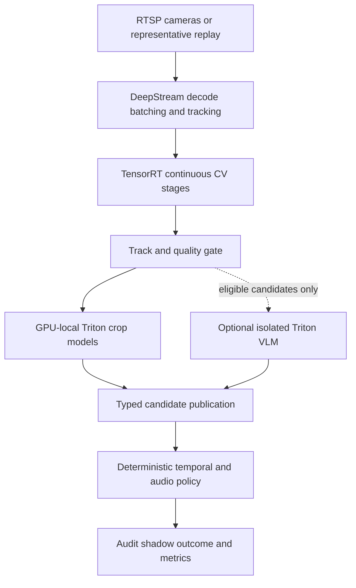
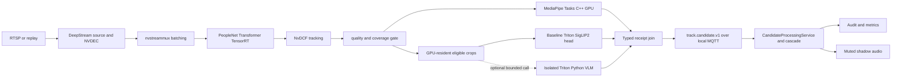
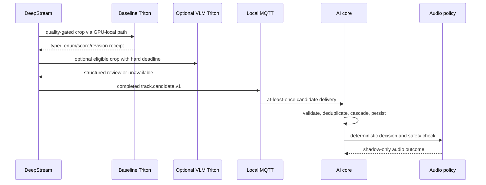

# Mandatory GPU Smoke Detection Release - Plan

## Goal Capsule

- **Objective:** Operators can run the existing smoking-behaviour service on a real NVIDIA GPU, process the 20-camera target with auditable model evidence, and know from qualification receipts whether the profile is lab-ready or production-ready.
- **Means:** Add a real GPU cascade whose continuous video stages use DeepStream and TensorRT, whose gated model stages use Triton, and whose final policy remains in the existing deterministic core.
- **Product authority:** `docs/draft.md` defines the government-site, on-premise, low-false-alarm product intent; this plan owns the mandatory GPU release and preserves the v1 audit and audio-safety contracts.
- **Open blockers:** The captured RTX 3090 host is not compatible with the repository's proposed DeepStream 9.1 row and has neither DeepStream nor Triton installed. This plan resolves the baseline to DeepStream 7.0 on Ubuntu 22.04/Ampere; the derived optional reviewer image remains disabled until its backend, license, load, memory, and latency receipts pass.

---

## Product Contract

### Summary

Deliver a GPU-enabled release that performs real decode, tracking, inference, evidence fusion, and gated review on NVIDIA hardware rather than through fake providers.
The RTX 3090 is the required lab target; a professional L40S-class profile remains the production qualification target.

### Problem Frame

The released service currently proves API, audit, replay, policy, and audio safety on a CPU/reference profile.
Its native media component is only an opt-in compile boundary, the GPU load gate is intentionally unimplemented, and existing qualification artifacts make no one-stream, 20-stream, latency, VRAM, or endurance claim.

The product intent needs near-real-time coverage of approximately 20 cameras while limiting politically costly false announcements for nose touching, betel chewing, phones, food, drinks, pens, steam, vaping, occlusion, and subjects with too few visible pixels.
A GPU release therefore has to prove both that real models execute and that overload or model uncertainty cannot bypass the existing safety policy.

### Key Decisions

- **Make GPU execution a release requirement.** A version advertised as GPU-enabled must satisfy the real-runtime and qualification receipts in R1, R11, and R12; compilation, CUDA visibility, or a fake provider is insufficient.
- **Use an evidence cascade rather than a single smoking model.** Independent visual, geometric, object, temporal, and optional reviewer evidence constrain R5, R6, R8, and R9.
- **Make the VLM earn its place.** The no-VLM cascade is the baseline, and a VLM is promoted only when the same sealed events show a worthwhile false-alarm improvement under R6 and R9.
- **Separate lab and production claims.** The RTX 3090 establishes reproducible development capacity under R11 and R12; only accepted professional hardware can establish the 24-hour production claim in R13.
- **Promote measured artifacts, not model-family names.** Exact weights, licenses, datasets, exports, thresholds, and runtime identities govern R7 through R10.
- **Preserve the core as the policy authority.** GPU runtimes produce typed evidence; only the deterministic domain and audio policy may create an announcement-eligible decision under R16.

<!-- ce-section: work-relationships -->
### How This Work Fits Together

This plan owns the GPU runtime, real model combination, and qualification evidence for the existing smoke-detection product; it does not replace the released CPU/reference baseline.

- **Depends on:** The existing v1 candidate, decision, audit, and audio-safety contracts remain authoritative.
- **Enables:** Site shadow operation and later automatic-audio consideration can begin only after the relevant lab, production, and quality gates pass.
- **Shares:** Dataset, evaluation, registry, observability, retention, and agent-artifact rules stay common to the CPU and GPU profiles.
- **Can proceed independently of:** Physical public-address integration and policy approval, because every GPU acceptance flow ends in shadow audio.

The release uses this functional boundary:



### Actors

- A1. **Site operator:** Starts the profile, watches readiness, mutes audio, and diagnoses camera or GPU degradation.
- A2. **Reviewer:** Labels silent-period events and named confounders without changing historical model decisions.
- A3. **ML/release owner:** Approves datasets, model provenance, evaluation, calibration, engine builds, and promotion or rollback.
- A4. **GPU media runtime:** Owns live ingest, hardware decode, batching, primary inference, tracking, crops, and stream health.
- A5. **Gated model runtime:** Serves crop classifiers and an optional reviewer within bounded GPU memory and queue budgets.
- A6. **AI core:** Owns evidence aggregation, deterministic temporal decisions, audit persistence, and audio safety.
- A7. **Coding agent:** Implements a bounded ticket, produces its verification and memory artifacts, and leaves reproducible commands for the next agent.

### Requirements

**Real GPU runtime and model combination**

- R1. The GPU profile must execute decode and at least two inference roles on a physical NVIDIA GPU, and its receipt must identify the device and driver plus each runtime's container digest, CUDA, TensorRT, DeepStream or Triton version, model revisions, and engine hashes. The media/baseline row and optional-reviewer row are separate runtime identities and may not share an engine receipt.
- R2. DeepStream must own RTSP or representative video ingest, NVIDIA hardware decode, multi-source batching, per-camera sampling, primary person detection, tracking, crop extraction, reconnect behavior, and typed candidate publication.
- R3. TensorRT must execute the continuous person and compact visual models, and every engine must be rejected when its model, precision, GPU capability, CUDA, TensorRT, calibration, or build-image identity differs from its release manifest.
- R4. Triton must serve at least one real gated crop model and expose readiness, request outcomes, queue time, inference time, and GPU-memory behavior; the optional VLM uses a separately bounded model slot.
- R5. The first baseline combination must use PeopleNet Transformer for person detection, NvDCF for tracking, the official MediaPipe Tasks C++ GPU Pose and Hand Landmarker path for hand-to-mouth geometry, and a locally trained or calibrated SigLIP 2 crop head for `cigarette`, `vape`, `phone`, `cup`, `food`, `pen_toothpick`, `betel_quid`, and `background` evidence.
- R6. Liquid LFM2-VL 1.6B is the RTX 3090 reviewer challenger only after its exact revision, runtime dependencies, backend, and LFM Open License disposition pass promotion; Phi-4 Multimodal, Gemma 4 12B, and Pixtral 12B remain larger-hardware challengers. No reviewer may receive continuous full streams or create positive evidence from `unclear`, malformed, timed-out, or unavailable output.
- R7. A candidate named in R5 or R6 may be replaced before promotion only when the replacement satisfies the same evidence role, procurement-origin rule, structured contract, target-GPU benchmark, and sealed evaluation.

**Data, training, and promotion**

- R8. Approved pretrained weights are bootstrap inputs for person, pose, and embedding roles, but site acceptance must use consented local positives and hard negatives split by camera, time, track, and person to prevent adjacent-frame leakage. The reviewer labels silent-period events under a recorded consent and retention disposition; the ML/release owner freezes the split and holds the sealed labels outside training and calibration access.
- R9. The named-negative crop head, temporal thresholds, and camera coverage thresholds must be trained or calibrated without reading the sealed acceptance labels; the same sealed events must compare no-VLM and each reviewer profile. The sealed report must separate staged from organic positives, include at least 100 organic positive events and 100 events for each named confounder across at least four cameras and 14 calendar days, and report 95% Wilson intervals with the existing precision and recall thresholds evaluated on the organic set.
- R10. Promotion must fail unless every code, weight, parent checkpoint, dataset, container, export, prompt, calibration, threshold, license, origin disposition, SBOM, hash, runtime profile, evaluation, and rollback target is immutable and locally available.

**GPU acceptance and capacity**

- R11. The one-stream gate must run a representative H.264 or H.265 stream through NVIDIA decode, the real R5 model roles, one Triton request, the deterministic decision service, audit persistence, and shadow audio without a fake inference provider.
- R12. The RTX 3090 lab gate must sustain the sealed 20-stream workload manifest for two hours at a configured analysis rate of at least 10 frames per second per healthy camera, process at least 99% of scheduled analysis samples, keep every queue bounded, and keep candidate-to-decision p95 at or below eight seconds excluding the configured behavioural persistence window. The manifest fixes each 1080p source's codec/profile, source FPS, bitrate range, GOP distribution, scene occupancy, visible-person count, eligible-crop and candidate-burst rate, confounder mix, and healthy or stalled status; the receipt binds to its hash.
- R13. A production claim requires the accepted L40S-class or better professional profile to satisfy R12 for 24 hours with representative site streams, no process crash, no cross-camera failure propagation, and no unbounded GPU-memory or queue growth.
- R14. The qualification must separately report each camera's input and analysis FPS, frame age, scheduled-sample loss, reconnect time, queue depth and age, batch fill, tracker continuity, candidate rate, and decision latency.

**Safety, operations, and handoff**

- R15. Metrics and logs must report GPU utilization, memory high-water mark, temperature, power, NVDEC utilization, process restarts, model readiness, Triton pending requests, inference failures, and deadline outcomes without track IDs, event IDs, raw URLs, or arbitrary model text as labels.
- R16. Missing pixels, a failed primary model, incomplete independent evidence, queue expiry, GPU OOM, engine mismatch, Triton failure, reviewer uncertainty, or revision mismatch must result in a degraded or rejected decision and no automatic audio.
- R17. One camera, model slot, or reviewer failure must not stop healthy cameras or the CPU control plane; restart and recovery must preserve idempotency, audit history, and bounded resource use.
- R18. The deployment must start offline from digest-pinned images and a local model repository, expose separate readiness for media, model roles, and the core, and refuse to advertise GPU readiness until R1 and R11 pass.
- R19. Every implementation slice must have an agent-claimable ticket, an isolated GitFlow branch or worktree where independent, exact verification evidence, a pushed remote branch, and a reusable memory note for material failures or surprising runtime constraints.

### Key Flows

- F1. **GPU profile startup**
  - **Trigger:** A1 starts the GPU profile from an offline bundle.
  - **Actors:** A1, A4, A5, A6.
  - **Steps:** Runtime identities and model manifests are checked; engines and model slots load; one-stream readiness is established before capacity is advertised.
  - **Outcome:** The profile becomes GPU-ready only when R1, R3, R4, R11, and R18 are satisfied.

- F2. **Evidence-gated smoking decision**
  - **Trigger:** A4 observes an optically eligible person track with hand-to-mouth motion.
  - **Actors:** A4, A5, A6.
  - **Steps:** Continuous CV produces geometry and crops; the named-negative head classifies evidence; the core aggregates cycles; only eligible candidates may reach the reviewer.
  - **Outcome:** The audit record identifies every evidence role and revision, and announcement eligibility follows R5, R6, and R16.

- F3. **GPU degradation**
  - **Trigger:** A model misses its deadline, a queue saturates, a stream stalls, or GPU memory becomes unavailable.
  - **Actors:** A1, A4, A5, A6.
  - **Steps:** The affected role or camera becomes degraded; pending incomplete evidence expires; the safety policy suppresses audio; bounded recovery is attempted.
  - **Outcome:** Healthy cameras continue and the operator can identify the failed boundary under R15 through R17.

- F4. **Model promotion and rollback**
  - **Trigger:** A3 proposes a new model combination, engine, threshold, or reviewer profile.
  - **Actors:** A2, A3, A4, A5, A6.
  - **Steps:** Provenance and runtime manifests are verified; sealed no-VLM and reviewer evaluations run; the candidate completes shadow and GPU qualification; rollback is rehearsed.
  - **Outcome:** Only a reproducible immutable release is promoted under R7 through R10.

- F5. **Capacity qualification**
  - **Trigger:** A3 requests a lab or production capacity claim.
  - **Actors:** A1, A3, A4, A5, A6.
  - **Steps:** Representative streams ramp from one to 4, 8, and 20; metrics and failure injections are captured; the receipt binds results to exact hardware and artifacts.
  - **Outcome:** The result is explicitly lab-qualified, production-qualified, or failed under R11 through R15.

### Acceptance Examples

- AE1. **Covers R1, R11, R18.** Given CUDA is visible but DeepStream uses no detector or Triton uses a fake model, when qualification runs, then GPU readiness fails and the receipt names the missing real role.
- AE2. **Covers R3, R16.** Given an engine was built for a different TensorRT patch or GPU capability, when the profile starts, then the engine is rejected before a camera can become ready and no audio is possible.
- AE3. **Covers R5, R6, R16.** Given hand-to-mouth motion with a positive phone, cup, food, pen, or betel prediction, when the cascade evaluates the track, then it records the named veto and makes no audio request.
- AE4. **Covers R6, R16.** Given an eligible candidate and a timed-out or malformed VLM response, when the core evaluates it, then the result is `review_unavailable` or equivalent and cannot become announcement-eligible.
- AE5. **Covers R12, R14, R17.** Given 20 replay streams and one stalled source on the RTX 3090, when the two-hour gate runs, then healthy streams remain within their budgets and only the stalled camera becomes degraded.
- AE6. **Covers R15 through R17.** Given the Triton reviewer exhausts its memory budget during a candidate burst, when recovery runs, then continuous decode and primary inference remain healthy, the burst yields no audio, and the operator sees the bounded failure metrics.
- AE7. **Covers R8 through R10.** Given a high-scoring model whose dataset license or parent checkpoint is missing, when promotion is requested, then promotion fails even if its accuracy exceeds the target.
- AE8. **Covers R13.** Given a two-hour RTX 3090 pass, when release evidence is presented for a government production site, then the system labels it lab-qualified and does not imply 24-hour L40S-class qualification.

### Success Criteria

- A clean offline RTX 3090 environment completes the real one-stream gate and the two-hour 20-stream lab gate with the exact receipts required by R1, R11, R12, R14, and R15.
- The selected production hardware completes the 24-hour gate in R13 before the service is represented as production-capable for 20 cameras.
- The sealed organic site evaluation satisfies R9's coverage minimum and reaches event precision of at least 0.80 and recall of at least 0.70 with one frozen model and policy profile; staged results and 95% Wilson intervals are reported separately.
- The evaluation publishes trigger rates for nose touching, betel chewing, phone, drink, food, pen or toothpick, steam, vape, heated tobacco, occlusion, and out-of-coverage subjects.
- The no-VLM result remains available. A reviewer is promoted only when it reduces named-confounder false positives by at least 20% relative to the same sealed no-VLM events, loses no more than 0.02 absolute recall, adds at most two seconds to candidate-to-decision p95, keeps total RTX 3090 memory high-water at or below 22 GiB, and passes provenance and license gates.
- An unfamiliar coding agent can reproduce the GPU build, one-stream test, load gate, fault injections, model promotion, rollback, and artifact audit from checked-in commands without oral instructions.

### Scope Boundaries

**In scope**

- A real NVIDIA GPU media and inference profile, model artifacts, offline deployment, fault handling, observability, and one-stream and 20-stream qualification.
- Data manifests, local hard-negative collection protocol, targeted training or calibration, sealed evaluation, model promotion, and rollback.
- Shadow-mode end-to-end decisions through the existing audit and audio-policy boundary.
- RTX 3090 lab qualification and a reproducible production-hardware qualification procedure.

**Deferred for later**

- Automatic public audio activation, which still requires the silent-period false-announcement budget, physical audio integration, retention approval, and written agency policy.
- A large reviewer that cannot coexist within the accepted GPU budget; it may be qualified on a separate professional GPU after the baseline ships.
- Multi-node high availability, cross-site federation, and automatic online learning.

**Outside this product's identity**

- Cloud inference, public-Internet runtime dependencies, face recognition, identity matching, microphone capture, punitive enforcement, or replacing the site's VMS or public-address system.
- Treating a VLM explanation as proof, using a VLM as an always-on full-stream detector, or accepting frame mAP as the only smoking-event quality measure.
- Committing raw or identifying video, credentials, downloaded datasets, generated model weights, TensorRT engines, or sensitive screenshots to Git.

### Dependencies and Assumptions

- The site provides representative H.264 or H.265 streams, camera credentials through mounted secrets, and enough pixels at the monitored distance to evaluate hand and face evidence.
- The RTX 3090 host may receive an approved driver or OS update, or planning may select a different digest-pinned DeepStream/Triton row that is supported on driver 580.126.09; the current capture is not a qualification pass.
- The organization can access the approved model and container registries during bundle creation, while the deployed service remains offline.
- Public datasets are seed material; consented local positives and named hard negatives are available before quality promotion.
- Procurement and legal reviewers provide a written disposition for model ancestry, licenses, personal-data retention, and public audio.
- Liquid LFM2-VL stays disabled unless the written disposition confirms that the LFM Open License covers both the agency and integrator or a separate license is obtained; failure removes the challenger without blocking the no-VLM baseline.
- Access to an accepted L40S-class or better host is required before any production-capable claim; without that hardware the release can complete only the RTX 3090 lab qualification.
- An operator is available to review silent-period events and to exercise mute, rollback, backup, and recovery procedures.

### Outstanding Questions

**Resolve Before Planning**

- None; planning can begin with the lab profile, while the decisions below become explicit research and qualification units.

**Resolved in Planning**

- Resolved by KTD1 and the Compatible Stack Resolution table: use the DeepStream 7.0 dGPU x86 row on Ubuntu 22.04/R580 for the RTX 3090 lab baseline. A different row, driver, or OS requires a failed U1 receipt and a separately approved stack decision.
- Resolved by KTD3, KTD5, and KTD6: DeepStream owns GPU-local baseline Triton calls through `gst-nvinferserver`; the optional LFM2-VL challenger uses a separately qualified Triton Python backend and stays disabled until its load, resource, provenance, and license receipts pass.
- Resolved by R12 and U7: GPU-107 owns a sealed metadata-only replay manifest that fixes codecs, source rates, bitrate/GOP distributions, occupancy, candidate bursts, confounders, stalled sources, and external clip hashes.

**Deferred to Execution Evidence**

- Does the R5 baseline fit its two-hour budget unchanged, or does PeopleNet Transformer, MediaPipe, or SigLIP 2 require a measured substitution under R7?
- What false audio alerts per camera-day threshold must the agency approve before automatic audio can leave shadow mode?

### Sources and Research

- `docs/draft.md` — government-site intent, 20-camera scale, false-alarm concerns, on-premise GPU target, and model-origin constraint.
- `docs/dev_artifacts/2026-08-24-system-architecture-and-delivery-plan.md` — existing v1 product and safety contract, GPU MVP boundary, and target qualification criteria.
- `docs/dev_artifacts/research/2026-08-24-model-pipeline-survey.md` — cascade, candidate models, provenance risks, local-data policy, and reviewer ablation.
- `docs/dev_artifacts/research/2026-08-24-onprem-video-analytics-architecture.md` — DeepStream/TensorRT/Triton roles, capacity metrics, isolation, and production-hardware boundary.
- `docs/dev_artifacts/research/2026-08-24-supported-stack-matrix.md` — candidate runtime rows and exact compatibility gaps.
- `docs/dev_artifacts/qualification/2026-08-24-video-302-host.md` — captured RTX 3090 host and unavailable GPU services.
- `docs/dev_artifacts/qualification/VIDEO-302-hardware-qualification.md` — unrun gate and required qualification receipt.
- `native/deepstream/README.md` and `tests/load/test_qualification_scaffolding.py` — current implementation boundary and intentionally absent GPU load harness.

> Product Contract preservation: The brainstorm's objective, actors, scope boundaries, safety posture, and lab/production split are preserved. Document review made the runtime identities, model/backend eligibility, sealed-data coverage, and reproducible workload gates measurable without adding automatic audio or widening product identity.

---

## Planning Contract

### Key Technical Decisions

- KTD1. **Use the DeepStream 7.0 dGPU x86 profile as the RTX 3090 lab media row.** NVIDIA's current compatibility table lists DeepStream 7.0 for Ubuntu 22.04, Ampere GPUs including RTX 30x0, CUDA 12.2, TensorRT 8.6.1.6, and display driver R535.161.08. The captured host is Ubuntu 22.04 with an RTX 3090 and R580.126.09, so it satisfies the stated driver floor. The host's installed CUDA 12.8 remains a host capability and does not change the container's CUDA 12.2 runtime.
- KTD2. **Use the official DeepStream 7.0 Triton image for the baseline gated path.** NVIDIA documents Triton 23.10 on dGPU through `deepstream:7.0-triton-multiarch` for x86. Pin the image by digest after import and use its Triton runtime for the baseline crop model. Do not claim compatibility from a tag alone.
- KTD3. **Keep the optional VLM in a separate Triton Python-backend profile.** Build a digest-pinned derivative of an approved Triton Python image with a locked Transformers 4.57-or-newer environment, the exact LFM2-VL model and processor revision, and a reviewed structured-output `model.py`. Triton 25.01/TensorRT-LLM does not by itself establish LFM2-VL support. The challenger stays disabled until one-image load/inference, RTX 3090 memory/latency, provenance, and written license receipts pass.
- KTD4. **Treat container CUDA versions as runtime identities.** The host driver is shared, but every TensorRT plan and model artifact is bound to its container CUDA, TensorRT, GPU compute capability, precision, calibration, and source hashes. An artifact built in the derived reviewer environment cannot be reused in the DeepStream 7.0/TensorRT 8.6 environment without a separate build and receipt.
- KTD5. **Keep pixels and GPU crop inference in the native media plane and policy in Python.** The DeepStream worker owns source, NVDEC, batching, detector, NvDCF, the MediaPipe Tasks C++ GPU pose/hand runtime, crop extraction, GPU-local Triton calls, reconnect, bounded queues, and typed model receipts. It publishes a completed `track.candidate.v1` envelope through the local MQTT transport. The Python `CandidateProcessingService` validates and deduplicates candidates, runs the deterministic cascade, persists decisions, and remains the only owner of audit and audio eligibility.
- KTD6. **Use DeepStream `gst-nvinferserver` and CUDA shared memory as the crop-model boundary.** The baseline SigLIP 2 head and any enabled reviewer receive only quality-gated GPU-resident crops from the native worker. They return enum/score/reason/revision receipts before candidate publication; raw pixels and free-form text never cross MQTT or enter the policy core. A missing, expired, malformed, or mismatched receipt makes the candidate incomplete and fail-closed.
- KTD7. **Make model acquisition an integrity, provenance, and license gate.** Each candidate model must have a canonical TLS source, publisher revision and checksum or signature when available, license text, parent-checkpoint chain, downloaded-file hash, tokenizer/config hash, export hash, SBOM, usage restrictions, and procurement disposition. Third-party weights use non-executable formats such as safetensors or ONNX; conversion runs in a network-restricted build container, and any Python backend source is vendored and reviewed. Missing integrity, lineage, or license evidence blocks promotion even when metrics pass.
- KTD8. **Build the no-VLM cascade first and compare challengers on sealed events.** The baseline uses PeopleNet Transformer, NvDCF, MediaPipe Pose/Hands, and a locally calibrated SigLIP 2 crop head with the R5 negative classes. Liquid LFM2-VL 1.6B is an optional reviewer challenger. A challenger cannot become a required dependency until it passes structured-output, memory, latency, provenance, and event-level ablation gates.
- KTD9. **Use receipts as the only qualification authority.** Readiness and release labels are derived from immutable host, image, model, engine, configuration, test, and telemetry receipts. A successful build, CUDA visibility, or skipped GPU test never counts as a qualification result.
- KTD10. **Parallelize independent work through ticket-owned worktrees.** Luna owns research and implementation tickets. Sol owns architecture decisions, ticket acceptance, integration review, and final plan/code review. Shared v1 contracts remain frozen; any contract change is proposed to the integration owner before editing.
- KTD11. **Separate lab and production claims.** RTX 3090 evidence may label the profile `gpu-lab-qualified` after R11/R12. It must never label the service production-capable. `gpu-production-qualified` requires an accepted professional GPU, the 24-hour gate, site streams, quality evidence, and policy/procurement approvals.
- KTD12. **Patch by re-pin and requalification.** GPU-101 checks imported SBOMs against known advisories at bundle creation. A runtime or model security update receives new digests and repeats GPU-101 plus all applicable GPU-107 gates; accepted unresolved exposure is named in the release receipt rather than silently inheriting an old image row.

### Compatible Stack Resolution

The following is the planning baseline for the captured host. Values marked `record-at-build` are intentionally resolved during implementation because the exact local digest and imported artifact hash do not exist yet.

| Layer | RTX 3090 lab baseline | Evidence and constraint |
|---|---|---|
| Host | Ubuntu 22.04.5 x86_64, RTX 3090 24 GB, driver 580.126.09, host CUDA 12.8 | Captured in `docs/dev_artifacts/qualification/2026-08-24-video-302-host.md`; host CUDA is not a substitute for container runtime identity. |
| Media image | `nvcr.io/nvidia/deepstream:7.0-triton-multiarch` x86_64, digest `record-at-build` | NVIDIA DeepStream 7.0 release notes document dGPU Triton 23.10 through this image. NVIDIA's compatibility table lists DS 7.0 with Ampere/RTX 30x0, Ubuntu 22.04, CUDA 12.2, TensorRT 8.6.1.6, and R535.161.08. |
| Baseline gated runtime | Triton 23.10 bundled by the DeepStream 7.0 Triton image | Keep the baseline crop model in this runtime so the first qualification has one supported media/model container row. |
| Optional reviewer image | Digest-pinned Triton Python-backend derivative, exact base and digest `record-at-build` | Must include a locked Transformers 4.57-or-newer environment and reviewed LFM2-VL handler. It remains disabled until backend load, memory, latency, provenance, and license receipts pass. |
| Engine targets | DeepStream row: TensorRT 8.6.1.6/FP16 or approved INT8; optional reviewer row: reviewed Python-backend model with immutable dependency lock | Engine and backend metadata must bind the source model, runtime, GPU CC 8.6, precision, calibration where applicable, and build image. Cross-row engine reuse is forbidden. |
| Host-driver rule | Keep R580.126.09 unless a qualification failure proves a driver change is required | CUDA compatibility documentation states that newer drivers support applications built with older CUDA toolkits; CUDA 12.2 requires at least R525.60.13 for minor-version compatibility. Record `nvidia-smi` and container runtime output in every receipt. |

This row is a compatibility baseline, not a pass decision. The first GPU ticket must pull and inspect the exact images, verify NVIDIA Container Toolkit access, record digests, and run the one-stream prerequisite. If an official image is unavailable to the organization's registry, the ticket records the failure and proposes a replacement row; it does not silently substitute DeepStream 9.1, upgrade Ubuntu, or change the host driver.

### Model and Artifact Contract

The role combination is fixed by the Product Contract, while the artifact instance is selected by the promotion gate.

| Role | Baseline artifact | Runtime | Required evidence |
|---|---|---|---|
| Person detection | PeopleNet Transformer | DeepStream `nvinfer`/TensorRT | NVIDIA or publisher model card, license/EULA, parent lineage, export hash, class map, input geometry, RTX 3090 latency. |
| Tracking | NvDCF | DeepStream `nvtracker` | DeepStream configuration hash, tracker parameters, continuity and recovery results. |
| Pose and hands | Official MediaPipe Tasks Pose and Hand Landmarker `.task` artifacts, exact revisions `record-at-build` | MediaPipe Tasks C++ GPU/EGL inside the media container | Official source and license, pinned MediaPipe revision, 33-pose/21-hand landmark schema, tracked-person crop rules, hand-to-mouth geometry mapping, missing-landmark behavior, and RTX 3090 latency. A failed container construction invokes R7 before U2 acceptance. |
| Crop evidence | SigLIP 2 backbone plus local calibrated head for `cigarette`, `vape`, `phone`, `cup`, `food`, `pen_toothpick`, `betel_quid`, and `background` | Triton 23.10 baseline, TensorRT/ONNX backend | Local dataset manifest, training seed/config, calibration, per-class metrics, export hash, runtime profile, and rollback target. |
| Optional reviewer | Liquid LFM2-VL 1.6B at an immutable publisher revision | Isolated Triton Python-backend profile | Model card and LFM Open License disposition, parent lineage, locked processor/runtime, reviewed structured-output handler, one-image load receipt, VRAM high-water mark, queue/deadline behavior, and no-VLM ablation. |

Acquisition is offline after bundle creation. A Luna implementation ticket may download approved artifacts into a non-Git staging directory only after recording the source URL, license, and hash in a metadata-only manifest. Weights, raw video, generated TensorRT plans, private paths, and credentials remain outside Git. The local model repository is immutable once a release receipt is created.

### High-Level Technical Design

The GPU profile has three failure domains. DeepStream owns high-rate media and GPU-local orchestration, Triton owns gated crop inference, and the Python core owns deterministic policy. The optional reviewer has its own process, queue, memory budget, and readiness state, but the native worker remains its only pixel-bearing caller.



The candidate boundary carries camera, track, source timestamps, quality, geometry, typed observations, per-role status and model revisions, and IDs for explicitly retained audit artifacts. Operational crops stay transient in GPU memory and are not written to disk or published. Every stage attaches a deadline and bounded queue owner. On deadline expiry or malformed output, the native join records an unavailable receipt; the Python service rejects or degrades the decision and never infers positive evidence from absence.



### Interfaces and Model Repository Shape

GPU-100 extends `CandidateEnvelope` additively with per-role model revisions and typed inference status/receipt fields. Old producers remain valid through defaults; the GPU bundle updates strict consumers before the native producer emits the new fields and drains any mixed-version broker queue. A breaking shape creates `track.candidate.v2`. The native worker serializes the envelope only after the GPU receipt join, and `CandidateProcessingService` maps it into `DomainObservation` without accessing pixels.

```text
model-repository/
  person_detector/1/model.plan
  pose_landmarker/1/pose_landmarker.task
  hand_landmarker/1/hand_landmarker.task
  crop_siglip2/1/model.onnx or model.plan
  reviewer_lfm2vl/1/model.py and locked environment
  <Triton-served model>/config.pbtxt
  manifest/model-release.json
```

The repository is mounted read-only. Numeric model directories are immutable release versions. The manifest records the model revision, runtime row, GPU capability, hashes, classes, input/output schema, license disposition, and rollback target. The native Triton client validates model readiness, request correlation, deadlines, and response revisions before candidate publication; the Python core independently validates the candidate receipt against the active release manifest.

### Implementation Constraints

- The base `uv` install stays CPU-safe. GPU dependencies live in image-specific build stages or optional groups and must not require CUDA for unit or contract tests.
- Operational crops remain GPU-resident and are destroyed after their bounded inference deadline. Only explicitly selected audit evidence enters the existing local artifact store, which is mounted only by media/core, uses restrictive ownership, and is deleted by the existing retention service; audio, metrics, and model containers cannot read it.
- The media container receives only camera, model, and selected-artifact mounts required for its profile. The audio container never receives the GPU device or `/dev/snd` from the analytics profile.
- Compose must expose independent readiness for media, model roles, and core. A missing or mismatched model makes GPU readiness false while healthy components remain observable.
- Triton, MQTT, media, and core use a Compose-internal network with no Triton or broker host ports. Triton starts with explicit model control disabled against the read-only repository; only bounded localhost readiness/metrics endpoints may be published.
- No runtime path downloads a model, follows a remote URL, or stores raw media in Git. Bundle creation is the only networked acquisition step and emits hashes plus license evidence. The runtime network is `internal: true`; model containers set `HF_HUB_OFFLINE=1` and `TRANSFORMERS_OFFLINE=1`, and qualification proves outbound connections fail.
- GPU qualification runs in shadow audio mode with physical output disabled. Automatic public audio remains outside this release boundary.

### Recommended Sequencing and Parallelization

The first merge order is the contract and stack receipts, then independent media/model/deployment lanes, then qualification and release integration.

| Ticket | Worktree and branch | Owner | Depends on | Owned files and artifacts |
|---|---|---|---|---|
| GPU-100 | `.worktrees/feature/GPU-100-evidence-contract` / `feature/GPU-100-evidence-contract` | Integration owner with Sol review | Existing v1 | Additive candidate/receipt contracts, generated schemas, native/Python contract fixtures, ticket artifact. |
| GPU-101 | `.worktrees/feature/GPU-101-stack` / `feature/GPU-101-stack` | Luna | Existing v1 | `deploy/image-pins.yaml`, `scripts/qualify_gpu_host.sh`, `docs/dev_artifacts/qualification/`, ticket and memory notes. |
| GPU-102 | `.worktrees/feature/GPU-102-deepstream` / `feature/GPU-102-deepstream` | Luna | GPU-100, GPU-101, GPU-103 | `native/deepstream/`, media configuration templates, native media tests, ticket artifacts. |
| GPU-103 | `.worktrees/feature/GPU-103-model-artifacts` / `feature/GPU-103-model-artifacts` | Luna | GPU-101 | `ml/registry/`, `ml/configs/`, `model-repository/` metadata/config templates, model receipts, ticket artifacts. |
| GPU-104 | `.worktrees/feature/GPU-104-candidate-service` / `feature/GPU-104-candidate-service` | Luna | GPU-100 and existing core ports | Live MQTT candidate service, domain mapping, decision/audio orchestration tests, ticket artifacts. |
| GPU-105 | `.worktrees/feature/GPU-105-gpu-deploy` / `feature/GPU-105-gpu-deploy` | Luna | GPU-101, GPU-103, GPU-104 | `deploy/Dockerfile.media`, `deploy/compose.yaml`, `configs/runtime.gpu-rtx3090.yaml`, offline bundle docs, ticket artifacts. |
| GPU-106 | `.worktrees/feature/GPU-106-data-eval` / `feature/GPU-106-data-eval` | Luna | GPU-103 and v1 MLOps contracts | `ml/datasets/`, `ml/training/`, `ml/evaluation/`, metadata-only dataset/model cards, ticket artifacts. |
| GPU-107 | `.worktrees/feature/GPU-107-qualification` / `feature/GPU-107-qualification` | Luna | GPU-102, GPU-104, GPU-105, GPU-106, GPU-108 | `scripts/qualify_gpu.py`, `tests/gpu/`, `tests/load/`, qualification receipt schema, ticket artifacts. |
| GPU-108 | `.worktrees/feature/GPU-108-observability` / `feature/GPU-108-observability` | Luna | Existing health/metrics contracts | `src/tp_smoke_detect/observability/`, degraded-mode integration tests, dashboards and alert rules, ticket artifacts. |
| GPU-109 | `.worktrees/feature/GPU-109-integration` / `feature/GPU-109-integration` | Integration owner with Sol review | GPU-106, GPU-107, GPU-108 | End-to-end fixtures, release report, runbooks, `AGENTS.md` GPU handoff additions, ticket artifacts. |

GPU-100, GPU-101, and GPU-108 form the initial parallel wave under separate ownership. GPU-104 follows GPU-100. GPU-103 follows GPU-101; GPU-102 starts after GPU-100, GPU-101, and GPU-103 fix the contracts, runtime row, and model artifacts. GPU-106 follows GPU-103, and GPU-105 follows GPU-101, GPU-103, and GPU-104. GPU-107 starts only after GPU-102, GPU-104, GPU-105, GPU-106, and GPU-108 are accepted, and GPU-109 is the final serial integration unit. Each ticket must push its branch, record exact verification evidence, and leave a reusable memory note for material failures.

### Assumptions and Deferred Execution Questions

- The organization can pull the NVIDIA images and approved model artifacts during bundle creation, even though the runtime has no egress.
- The current host has enough CPU, disk, and PCIe bandwidth for the 20-stream replay pack; this is measured by GPU-107, not assumed from GPU memory alone.
- PeopleNet Transformer, MediaPipe Pose/Hands, and SigLIP 2 remain the first candidates only if their acquisition and origin evidence passes GPU-103 and GPU-106. The implementation may invoke the R7 replacement gate when evidence fails.
- The site will provide representative codecs, resolutions, GOPs, lighting, camera distance, and hard negatives before a production claim.
- The final false-audio budget, quiet hours, retention period, and automatic-audio approval remain agency decisions and do not block the lab GPU profile.
- Exact image digests, model versions, TensorRT engine hashes, and threshold values are execution-time facts. The plan requires them in receipts but does not invent them.

### System-Wide Impact

- **Runtime isolation:** The media worker, baseline Triton, optional reviewer, Python core, and audio adapter need independent readiness, restart, queue, and memory telemetry.
- **Security and privacy:** RTSP credentials and crops stay in mounted local storage. Model acquisition is the only workflow allowed to contact registries, and its outputs are metadata plus hashes in the repository.
- **Availability:** A stalled camera, Triton timeout, reviewer OOM, engine mismatch, or GPU reset degrades only the affected boundary and suppresses audio for incomplete evidence.
- **Governance:** Model, dataset, engine, configuration, and qualification receipts are release evidence. Human review can add labels but cannot rewrite historical decisions.
- **Agent parity:** Every qualification, promotion, rollback, and receipt validation action is exposed through checked-in scripts and documented runbooks so a new coding agent does not need operator shell history.

### Risks and Mitigations

| Risk | Mitigation |
|---|---|
| DS7.0 or Triton 23.10 image is unavailable in the approved registry | GPU-101 records the failed import and compares an explicitly documented replacement row. No tag-only or silent version substitution is allowed. |
| Host R580 runs the DS7 CUDA 12.2 image but the container's decoder or TensorRT path fails | Fail the host receipt, preserve the CPU profile, and require a Sol-approved stack decision before changing the driver or OS. |
| DeepStream native graph emits incomplete metadata | GPU-102 adds metadata-integrity tests and rejects candidates without quality, timestamps, revisions, and camera/track identity. |
| TensorRT plan is copied between runtime rows | GPU-103 validates the engine manifest against runtime, CC 8.6, precision, calibration, and source hashes before readiness. |
| VLM consumes all VRAM or blocks the crop head | GPU-104 keeps VLM disabled by default, uses a separate process/queue, caps concurrency, and turns failures into `review_unavailable`. |
| Public model license or parent lineage is unacceptable | GPU-103/GPU-106 block promotion and require an approved replacement under R7. |
| Public metrics hide overload or unusable camera periods | GPU-107 reports scheduled samples, frame age, drops, queue age, optical eligibility, and candidate latency beside accuracy. |
| One stream failure propagates to all cameras | GPU-102/GPU-108 inject a stalled source and verify per-camera degradation with healthy-stream continuity. |

### Sources and Research

The plan uses the supplied repository grounding and claim verification as its local evidence. The load-bearing external compatibility evidence is:

- [NVIDIA DeepStream installation and dGPU compatibility table](https://docs.nvidia.com/metropolis/deepstream/dev-guide/text/DS_Installation.html) — DeepStream 7.0 lists Ampere/RTX 30x0, Ubuntu 22.04, CUDA 12.2, TensorRT 8.6.1.6, and R535.161.08; the same table distinguishes newer DeepStream rows that require Ubuntu 24.04/CUDA 13.x.
- [NVIDIA DeepStream 7.0 release notes](https://docs.nvidia.com/metropolis/deepstream/DeepStream_7.0_Release_Notes.pdf) — dGPU Triton 23.10 is supported through `deepstream:7.0-triton-multiarch` for x86.
- [NVIDIA CUDA minor-version compatibility](https://docs.nvidia.com/deploy/cuda-compatibility/minor-version-compatibility.html) — newer drivers retain backward compatibility with applications built against older CUDA toolkits; this supports using the DS7 CUDA 12.2 container on the captured R580 host, subject to runtime qualification.
- [NVIDIA Triton 25.01 release notes](https://docs.nvidia.com/deeplearning/triton-inference-server/archives/triton-inference-server-2550/release-notes/rel-25-01.html) — evidence for a considered base image; it does not establish LFM2-VL TensorRT-LLM support, so KTD3 requires a separately qualified Python backend.
- [NVIDIA Triton model repository guide](https://docs.nvidia.com/deeplearning/triton-inference-server/user-guide/docs/user_guide/model_repository.html) — numeric model-version directories, `config.pbtxt`, repository startup, and GPU-specific TensorRT plan constraints.
- `docs/dev_artifacts/research/2026-08-24-supported-stack-matrix.md`, `docs/dev_artifacts/research/2026-08-24-onprem-video-analytics-architecture.md`, and `docs/dev_artifacts/research/2026-08-24-model-pipeline-survey.md` — prior stack, pipeline, model, capacity, and provenance research.
- `docs/dev_artifacts/qualification/2026-08-24-video-302-host.md` and `docs/dev_artifacts/qualification/VIDEO-302-hardware-qualification.md` — current host capture and explicit statement that no GPU qualification has run.

---

## Output Structure

```text
configs/
  runtime.gpu-rtx3090.yaml
deploy/
  Dockerfile.media
  compose.yaml
  image-pins.yaml
model-repository/
  manifest/model-release.json
  <model-role>/<numeric-version>/config.pbtxt
ml/
  datasets/
  evaluation/
  registry/
  training/
native/deepstream/
  include/tp_smoke_detect/media/
  src/
scripts/
  qualify_gpu.py
  qualify_gpu_host.sh
src/tp_smoke_detect/
  adapters/messaging/mqtt.py
  application/candidate_processing.py
  observability/
tests/
  gpu/
  load/
docs/dev_artifacts/
  qualification/
  tickets/
  memory/
```

The tree is a planning shape, not permission to commit model weights, TensorRT plans, private media, or secrets. Unit file lists below are authoritative for each ticket.

---

## Implementation Units

### U0. GPU evidence contract and deployment compatibility (GPU-100)

- **Goal:** Freeze the pixels-free GPU evidence boundary before parallel media and core work begins.
- **Requirements:** R1, R3 through R7, R10, R16, R17, R19.
- **Dependencies:** Existing v1 candidate, decision, audit, and inference contracts.
- **Files:** `src/tp_smoke_detect/contracts.py`, `src/tp_smoke_detect/domain/models/observations.py`, `schemas/smoke/v1/track.candidate.v1.json`, `native/deepstream/include/tp_smoke_detect/media/candidate.hpp`, `native/deepstream/src/candidate.cpp`, `tests/contract/`, `docs/dev_artifacts/tickets/GPU-100.md`.
- **Approach:**
  1. Add optional per-role inference receipts and model revisions to `CandidateEnvelope`, including role, status, bounded reason enum, score/output schema, request correlation, deadline outcome, and artifact revision; preserve old payload validation through defaults.
  2. Add typed reviewer evidence without free-form text and define the exact mapping into `DomainObservation`; unavailable or mismatched roles can never populate a positive channel.
  3. Update native and Python fixtures together, regenerate the schema, and prove old v1 fixtures remain readable. Treat a shape that cannot remain additive as `track.candidate.v2` rather than weakening strict validation.
  4. Define the atomic GPU-bundle deployment order: update strict consumers, drain the local broker, then start the new native producer; rollback uses the prior producer and schema bundle together.
- **Test scenarios:**
  - Given an old v1 candidate without GPU receipt fields, the updated core accepts it and defaults the new roles to unavailable.
  - Given a complete detector, pose, object, and optional-reviewer receipt set, native JSON and Python validation preserve correlation, status, and exact model revisions.
  - Given a timeout, stale revision, unknown status, free-form reviewer output, or positive result on a failed receipt, validation rejects the positive evidence path.
  - Given an old strict consumer, the deployment rehearsal prevents the new producer from publishing until that consumer is replaced and the broker queue is drained.
- **Verification:** Contract/schema/native fixtures pass in CPU CI, and Sol accepts the additive-compatibility and deployment-order receipt before GPU-102 or GPU-104 merges.

### U1. GPU stack and host/import qualification (GPU-101)

- **Goal:** Prove the pinned RTX 3090 host/container row is executable before any service claims GPU readiness.
- **Requirements:** R1, R3, R11, R18, R19.
- **Dependencies:** Existing v1 contracts and deployment scaffold.
- **Files:** `deploy/image-pins.yaml`, `scripts/qualify_gpu_host.sh`, `docs/dev_artifacts/qualification/2026-08-24-video-302-host.md`, `docs/dev_artifacts/qualification/gpu-rtx3090-stack.md`, `docs/dev_artifacts/tickets/GPU-101.md`, `docs/dev_artifacts/memory/`.
- **Approach:**
  1. Inspect host OS, architecture, GPU, driver, CUDA visibility, Docker, NVIDIA Container Toolkit, and NVDEC capability.
  2. Pull the exact DeepStream 7.0 Triton image into the approved staging registry, record its immutable digest and SBOM, and verify it against the compatibility evidence. GPU-103 separately builds and qualifies the optional reviewer image.
  3. Run container-level CUDA, TensorRT, DeepStream, Triton health, and device-isolation probes without declaring a qualification pass.
  4. Emit a receipt with pass/fail per component and an explicit reason for any unavailable row.
- **Execution note:** Start with a failing receipt test for missing image, driver, or SDK evidence. Do not modify the host driver or OS from the ticket.
- **Patterns to follow:** `scripts/qualify_media_host.sh`, `deploy/image-pins.yaml`, and the existing qualification artifacts.
- **Test scenarios:**
  - Given the captured Ubuntu 22.04/R580/RTX 3090 host and a pulled DS7 image, the receipt records the matching Ampere/OS/runtime row and exposes a real CUDA device.
  - Given an image digest is missing or a required command is unavailable, the script exits with an unqualified result and names the missing evidence.
  - Given the optional reviewer image is absent, the baseline stack remains testable while the reviewer profile is marked unavailable rather than silently substituted.
  - Given the container can see CUDA but `deepstream-app` or Triton readiness fails, GPU readiness remains false.
- **Verification:** A reviewer can reproduce the receipt from the checked-in script, compare each version with the linked NVIDIA evidence, and see no GPU qualification claim until U7 passes.

### U2. DeepStream media graph and typed candidate boundary (GPU-102)

- **Goal:** Replace the native placeholder with a real DeepStream media graph that publishes bounded, auditable candidate metadata.
- **Requirements:** R2, R3, R11, R14, R16, R17.
- **Dependencies:** U0, U1, U3.
- **Files:** `native/deepstream/CMakeLists.txt`, `native/deepstream/include/tp_smoke_detect/media/`, `native/deepstream/src/`, `native/deepstream/tests/`, `docs/dev_artifacts/tickets/GPU-102.md`.
- **Approach:**
  1. Keep a DeepStream-specific adapter behind the existing native build option and bind the build to the verified DS7 SDK root.
  2. Implement source, NVDEC, `nvstreammux`, primary detector, NvDCF tracker, quality/coverage gate, and the pinned MediaPipe Tasks C++ GPU/EGL Pose and Hand Landmarkers on tracked-person crops.
  3. Invoke baseline Triton through `gst-nvinferserver` and any enabled reviewer through a bounded GPU-local/CUDA-shared-memory request; join typed, correlated, revision-checked receipts before publication.
  4. Publish the U0 candidate contract over local MQTT and map stream, model, queue, landmark, and metadata failures to per-camera degraded state without stopping healthy cameras.
- **Technical design:** The graph keeps recent frames only for media freshness, never persists operational crops, and never queues unbounded tensors. Candidate publication is the pixels-free boundary.
- **Patterns to follow:** `native/deepstream/src/candidate.cpp`, `native/deepstream/src/media_worker.cpp`, `native/deepstream/include/tp_smoke_detect/media/candidate.hpp`, and `tests/contract/test_native_fixture.py`.
- **Test scenarios:**
  - Given one H.264 replay stream, real decode and detector metadata produce a valid candidate with stable camera/track identity and no raw pixels.
  - Given an H.265 stream or decoder error, the camera reports a bounded degraded state and reconnects without corrupting other cameras.
  - Given a full per-camera queue, the oldest frame is dropped under the existing policy and drop counters increase without cross-camera queue growth.
  - Given incomplete quality, timestamp, or model revision metadata, candidate publication is rejected and no decision/audio path is invoked.
  - Given missing landmarks, Triton timeout/OOM, malformed output, or stale revision, the native join records the role unavailable and cannot publish a positive channel.
  - Given one stalled source among multiple sources, healthy sources continue publishing candidates.
- **Verification:** Native tests pass in CPU mode; GPU-container tests prove real DeepStream graph construction, metadata integrity, reconnect, and per-camera isolation on the qualified host.

### U3. TensorRT engines, model acquisition, and immutable repository (GPU-103)

- **Goal:** Produce reproducible model artifacts and engine manifests for the R5 roles without placing weights or private data in Git.
- **Requirements:** R3, R5, R7, R8, R10, R18, R19.
- **Dependencies:** U1 and existing `ml/registry/` contracts.
- **Files:** `ml/registry/model_card.py`, `ml/registry/release.py`, `ml/configs/`, `model-repository/manifest/model-release.json`, `model-repository/*/config.pbtxt`, `docs/dev_artifacts/qualification/model-artifact-receipts/`, `docs/dev_artifacts/tickets/GPU-103.md`.
- **Approach:**
  1. Define metadata-only acquisition records for PeopleNet Transformer, MediaPipe Pose/Hands, SigLIP 2, and Liquid LFM2-VL 1.6B, including canonical source, license, parent lineage, source hash, export hash, and restrictions.
  2. Verify canonical TLS origin, publisher revision/checksum when available, hashes, SBOM, tokenizer/config identity, class maps, model-card evidence, and license disposition in a network-restricted staging build.
  3. Build FP16/approved INT8 TensorRT plans for compute capability 8.6 in the DS7 row; pin the MediaPipe `.task` artifacts separately and build the optional reviewer Python-backend image with locked Transformers, processor, and reviewed handler source.
  4. Emit strict repository configuration, run SigLIP/PeopleNet export-compatibility probes and a one-image LFM2 load/inference probe, and record rollback targets. Failure invokes R7 before downstream tickets proceed.
- **Execution note:** Treat missing license, lineage, parent checkpoint, or export evidence as a failing promotion test before measuring accuracy.
- **Patterns to follow:** `ml/registry/model_card.py`, `ml/registry/release.py`, `ml/datasets/manifest.py`, `docs/runbooks/model-release.md`.
- **Test scenarios:**
  - Given a complete model card and hash set, the release manifest validates and the repository contains only metadata/configuration plus externally staged artifacts.
  - Given a missing license, parent checkpoint, or source hash, promotion fails even when a model file is present.
  - Given an engine built for a different TensorRT/CUDA/GPU profile, readiness rejects it before a camera becomes ready.
  - Given a valid TensorRT plan, Triton loads only the requested numeric version and reports model revision and readiness.
  - Given a rollback target, the repository and manifest identify a prior immutable version without mutating historical receipts.
- **Verification:** Artifact receipts show canonical provenance, hashes, runtime bindings, SBOM, and rollback metadata; an independent agent can rebuild or reject each role from the manifest.

### U4. Live candidate processing service (GPU-104)

- **Goal:** Turn pixels-free GPU candidates into idempotent persisted decisions and shadow-audio outcomes in a production service rather than only an e2e callback.
- **Requirements:** R4 through R7, R10, R16, R17.
- **Dependencies:** U0 and existing cascade, repository, audio-policy, and health ports.
- **Files:** `src/tp_smoke_detect/application/candidate_processing.py`, `src/tp_smoke_detect/adapters/messaging/mqtt.py`, `src/tp_smoke_detect/cli.py`, `tests/contract/test_candidate_processing.py`, `tests/integration/test_gpu_model_failures.py`, `docs/dev_artifacts/tickets/GPU-104.md`.
- **Approach:**
  1. Promote the local MQTT profile to the GPU transport and implement `CandidateProcessingService` with bounded subscription concurrency, strict schema/manifest validation, event-id deduplication, and one cascade state per camera/track.
  2. Map typed native receipts into `DomainObservation`, persist the decision transactionally, invoke `AudioRequestService` in shadow mode, and acknowledge only after durable completion.
  3. Define retry, poison-message quarantine, broker reconnect, backpressure, graceful shutdown, and replay-safe restart semantics; no failed or incomplete receipt may create positive evidence.
  4. Expose separate consumer-lag, processing, persistence, policy, and readiness signals without identifiers in metric labels.
- **Patterns to follow:** `tests/e2e/test_cpu_vertical_slice.py`, `src/tp_smoke_detect/application/model_router.py`, and the existing idempotent repository/audio services.
- **Test scenarios:**
  - Given an at-least-once duplicate candidate, exactly one decision and at most one shadow-audio receipt exist.
  - Given incomplete, malformed, expired, or revision-mismatched native evidence, the service persists a degraded/rejected decision and cannot request audio.
  - Given broker or database interruption, acknowledgement waits for durable completion and recovery does not duplicate decisions.
  - Given queue saturation or shutdown, intake is bounded, inflight work finishes or is safely retried, and healthy core readiness remains truthful.
- **Verification:** Contract and integration tests prove live wiring from MQTT candidate through cascade, audit, and shadow policy, including retries, backpressure, deduplication, and fail-closed receipts.

### U5. GPU deployment and offline bundle (GPU-105)

- **Goal:** Ship a digest-pinned GPU profile that starts offline with separate readiness and least-privilege boundaries.
- **Requirements:** R1, R4, R10, R15, R17, R18.
- **Dependencies:** U1, U3, and U4.
- **Files:** `deploy/Dockerfile.media`, `deploy/compose.yaml`, `configs/runtime.gpu-rtx3090.yaml`, `configs/model-profile-gpu-rtx3090.yaml`, `deploy/prometheus/prometheus.yml`, `docs/runbooks/installation.md`, `docs/dev_artifacts/tickets/GPU-105.md`.
- **Approach:**
  1. Add explicit `gpu-rtx3090` and optional `gpu-vlm` Compose profiles with the verified image digests.
  2. Consume GPU-101's image pins, mount the model repository read-only, and keep acquisition, generated plans, secrets, and media outside Git.
  3. Put media, MQTT, Triton, reviewer, and core on an internal network with no broker/Triton host ports; disable explicit Triton model control, set offline loader flags, and give GPU access only to media/model services.
  4. Expose media, baseline-model, reviewer-model, candidate-consumer, core, and overall readiness separately; mount retained evidence only into media/core and enforce the existing retention job.
- **Test scenarios:**
  - Given a complete offline bundle and image/model digests, the baseline profile starts without network access and reports all required readiness components.
  - Given a missing digest, model repository, engine, or host GPU, startup refuses GPU readiness and names the missing artifact.
  - Given the optional reviewer profile is omitted, the baseline profile still starts and remains no-VLM.
  - Given a process attempts outbound network access or a host attempts a Triton/broker connection, the connection fails while internal readiness remains available.
  - Given the media container is compromised or restarted, the core and audio safety defaults remain active and no automatic audio is emitted.
- **Verification:** Compose validation, offline startup, image inspection, readiness probes, and security review confirm the GPU profile is reproducible and does not broaden device, filesystem, or network access.

### U6. Dataset, training, calibration, and sealed evaluation (GPU-106)

- **Goal:** Train or calibrate the local crop head and produce event-level evidence for the no-VLM baseline and reviewer challenger.
- **Requirements:** R7, R8, R9, R10, success criteria, AE3, AE4, AE7.
- **Dependencies:** U3 and existing MLOps contracts.
- **Files:** `ml/datasets/manifest.py`, `ml/training/`, `ml/evaluation/metrics.py`, `ml/evaluation/ablation.py`, `ml/configs/evaluation.json`, `docs/dev_artifacts/research/`, `docs/dev_artifacts/qualification/`, `docs/dev_artifacts/tickets/GPU-106.md`.
- **Approach:**
  1. Register approved public seed data and consented local data as metadata-only manifests with license and retention dispositions.
  2. Collect or import local positives and named hard negatives, then split by camera, time, track, and person to prevent adjacent-frame leakage.
  3. Calibrate the SigLIP 2 head and temporal thresholds without reading sealed acceptance labels.
  4. Run the same sealed events through no-VLM and each reviewer profile, enforce R9's organic/staged coverage contract, and report event precision/recall, 95% Wilson intervals, and each named confusion class.
  5. Package the winning candidate with training seed/config, data hashes, calibration, threshold, runtime, and rollback metadata.
- **Execution note:** Use a sealed-evaluation-first workflow. A frame-only metric cannot promote a smoking-event model.
- **Test scenarios:**
  - Given a manifest with missing license or retention disposition, dataset registration fails without copying media into Git.
  - Given adjacent frames from the same track in both splits, the split validator rejects leakage.
  - Given a sealed event set, training/calibration cannot read labels and the evaluation report contains an immutable event-set hash.
  - Given phone, cup, food, pen/toothpick, betel, steam, vape, occlusion, and out-of-coverage events, the report publishes separate trigger rates and error categories.
  - Given a VLM that improves recall but exceeds the memory/deadline or provenance gate, the no-VLM profile remains the promoted baseline.
- **Verification:** The evaluation receipt reaches the Product Contract quality thresholds or records a failed promotion with the exact missing gate; no model weight or private media enters Git.

### U7. One-stream, 20-stream, and fault-injection qualification (GPU-107)

- **Goal:** Implement the real GPU qualification harness and produce lab or production receipts without fake inference.
- **Requirements:** R1, R11, R12, R13, R14, R15, R16, R17, AE1, AE2, AE5, AE6, AE8.
- **Dependencies:** U2, U4, U5, U6, U8.
- **Files:** `scripts/qualify_gpu.py`, `tests/load/replay-pack.yaml`, `tests/gpu/test_one_stream.py`, `tests/load/test_gpu_qualification.py`, `docs/dev_artifacts/qualification/`, `docs/dev_artifacts/tickets/GPU-107.md`, `docs/dev_artifacts/memory/`.
- **Approach:**
  1. Run a one-stream H.264/H.265 replay through real NVDEC, the R5 roles, one Triton request, core decision/audit, and muted shadow audio.
  2. Seal a metadata-only replay-pack manifest with external clip hashes and R12's codec, source-FPS, bitrate/GOP, occupancy, candidate-burst, confounder, and stalled-camera fields; bind every receipt to its manifest hash.
  3. Ramp the sealed replay pack from one to 4, 8, and 20 streams, then sustain the RTX 3090 profile for two hours at at least 10 analysis FPS per healthy camera.
  4. Record scheduled samples, losses, queue depth/age, batch fill, frame age, tracker continuity, candidate rate, candidate-to-decision latency, GPU/VRAM/NVDEC utilization, and restart/reconnect events.
  5. Inject stalled source, Triton timeout/restart, malformed output, reviewer OOM, engine mismatch, queue expiry, and GPU reset conditions, then label the receipt from all required evidence; never infer a pass from a skipped test.
- **Test scenarios:**
  - Given one real stream and all R5 roles ready, the receipt includes host/image/model/engine identities and proves no fake provider was used.
  - Given 20 representative streams for two hours, the receipt requires at least 99% scheduled sample processing, bounded queues, and candidate-to-decision p95 at or below eight seconds excluding persistence.
  - Given one stalled stream, healthy streams remain within budget and only the affected camera is degraded.
  - Given Triton timeout/OOM/restart, incomplete evidence expires, audio remains suppressed, and the core stays live.
  - Given an engine or manifest mismatch, GPU readiness fails before camera readiness and no audio path is eligible.
  - Given a two-hour RTX 3090 pass, the receipt says lab-qualified and cannot satisfy the production 24-hour claim.
- **Verification:** The opt-in GPU test suite passes only on a qualified host and emits machine-readable plus human-readable receipts. CPU CI continues to skip GPU tests with an explicit reason.

### U8. GPU observability and degraded-mode integration (GPU-108)

- **Goal:** Make GPU health, overload, model readiness, and fail-closed decisions visible without high-cardinality leakage.
- **Requirements:** R14, R15, R16, R17, AE5, AE6.
- **Dependencies:** Existing health/metrics contracts; can begin in parallel with U1/U3.
- **Files:** `src/tp_smoke_detect/observability/health.py`, `src/tp_smoke_detect/observability/metrics.py`, `src/tp_smoke_detect/observability/structured.py`, `deploy/prometheus/rules.yml`, `deploy/prometheus/dashboard.json`, `tests/integration/test_metrics.py`, `tests/integration/test_gpu_degraded_modes.py`, `docs/dev_artifacts/tickets/GPU-108.md`.
- **Approach:**
  1. Add bounded labels for camera, component, stage, model role, mode, state, and status only.
  2. Capture GPU utilization, memory high-water, temperature, power, NVDEC utilization, queue depth/age, batch fill, model readiness, pending requests, inference failures, deadline outcomes, restarts, and per-camera frame age.
  3. Keep track IDs, event IDs, URLs, raw model text, and arbitrary error text out of labels.
  4. Add alerts for readiness loss, queue age, sample loss, memory pressure, and repeated restart while retaining per-camera isolation.
- **Test scenarios:**
  - Given normal one-stream operation, the metrics expose all required bounded measurements with allowed labels only.
  - Given a burst of unique track/event IDs or arbitrary model text, metric construction rejects or normalizes the value without creating new label series.
  - Given queue saturation or GPU memory pressure, the health snapshot names the affected component/camera and the policy records no-audio degraded decisions.
  - Given one camera restart, unrelated camera and core health remain ready.
- **Verification:** Metrics tests, dashboard/rule validation, and failure-injection integration tests demonstrate bounded cardinality and operator-visible recovery signals.

### U9. End-to-end integration, release evidence, and coding-agent handoff (GPU-109)

- **Goal:** Integrate the GPU lanes, certify the release boundary, and leave a reproducible handoff for future Luna agents.
- **Requirements:** R1 through R19, all acceptance examples, all success criteria.
- **Dependencies:** U6, U7, U8, and accepted U2-U5 reviews.
- **Files:** `tests/e2e/test_gpu_vertical_slice.py`, `tests/contract/`, `docs/runbooks/installation.md`, `docs/runbooks/operations.md`, `docs/runbooks/model-release.md`, `docs/dev_artifacts/reviews/`, `docs/dev_artifacts/qualification/`, `docs/dev_artifacts/tickets/GPU-109.md`, `docs/dev_artifacts/memory/`, `AGENTS.md`.
- **Approach:**
  1. Integrate the real media, Triton, core, audit, metrics, and muted audio path using the one-stream fixture.
  2. Verify model and configuration revisions appear in decisions and receipts end to end.
  3. Rehearse rollback to the previous immutable model release and recovery after media/model restart.
  4. Publish the lab-qualified result only when U7's RTX 3090 gate passes; publish production qualification only after the separate L40S-class 24-hour gate and site approvals.
  5. Update `AGENTS.md` with GPU ticket ownership, qualification commands, artifact rules, and the no-fake-provider boundary.
- **Test scenarios:**
  - Given a real one-stream replay, a candidate flows to deterministic decision and audit persistence with the expected model/runtime revisions.
  - Given a positive phone/cup/food/betel event, the named veto is recorded and no audio command is announced.
  - Given a reviewer timeout or model restart, the event remains auditable as degraded/reviewer-unavailable and cannot become audio-eligible.
  - Given rollback, the prior release is loaded with matching manifest and new decisions reference the rollback revision without rewriting history.
  - Given only RTX 3090 lab evidence, release documentation does not state 24-hour production or 20-camera production capability.
- **Verification:** Sol's integration review finds no unresolved P0/P1 plan/code issue, the CPU and GPU gates are both recorded, the release artifacts are pushed with the GitFlow branch lineage, and a fresh agent can follow `AGENTS.md` without oral context.

---

## Verification Contract

### Baseline gates that must remain green

| Gate | Command | Expected evidence |
|---|---|---|
| Formatting and lint | `uv run ruff format --check .` and `uv run ruff check .` | No formatting or lint regressions in CPU-safe code. |
| Static typing | `uv run mypy src tests` | Existing and added adapters type-check without GPU imports in the base environment. |
| CPU unit/contract/integration | `uv run pytest tests/unit tests/contract tests/integration` | Existing deterministic behavior and fail-closed safety remain green. |
| Schema/config/demo | `uv run smoke-detect schema --output schemas/smoke/v1`, `uv run smoke-detect validate-config configs/camera.example.yaml`, `uv run smoke-detect demo --fixture synthetic` | v1 contracts and CPU demo remain reproducible. |
| Native reference | `cmake -S native/deepstream -B native/deepstream/build -DBUILD_TESTING=ON`, `cmake --build native/deepstream/build`, `ctest --test-dir native/deepstream/build --output-on-failure` | CPU reference path remains available without NVIDIA SDK. |
| Compose | `docker compose -f deploy/compose.yaml config` | CPU and GPU profile syntax validates without starting devices. |
| Secret/artifact scan | `gitleaks detect --source . --no-git` plus the repository artifact allowlist check | No credential, RTSP URL, secret content, private path, media, weight, or generated engine enters the release tree. |

### GPU gates

| Gate | Command or procedure | Release signal |
|---|---|---|
| Host/import receipt | `scripts/qualify_gpu_host.sh --profile rtx3090` | Host matches the planned row, image digests are captured, and missing components fail closed. |
| One stream | `uv run python scripts/qualify_gpu.py --profile rtx3090 --streams 1 --real-runtime` | R11 receipt includes real decode, R5 model roles, Triton, core, audit, and shadow audio. |
| Twenty-stream lab | `uv run python scripts/qualify_gpu.py --profile rtx3090 --streams 20 --duration 2h --analysis-fps 10` | R12 passes all sample, queue, latency, health, and telemetry thresholds. |
| Failure isolation | `SMOKE_RUN_GPU_QUALIFICATION=1 uv run pytest tests/gpu tests/load/test_gpu_qualification.py tests/integration/test_gpu_degraded_modes.py` | Engine mismatch, timeout, OOM, stalled source, and restart cases suppress audio and preserve healthy components. |
| Model promotion | `uv run python -m ml.registry.release validate --manifest model-repository/manifest/model-release.json` | R7-R10 provenance, license, runtime, evaluation, and rollback gates pass. |
| Sealed quality | `uv run python -m ml.evaluation.ablation --config ml/configs/evaluation.json --sealed` | Event-level precision/recall and named confusion classes are recorded for no-VLM and reviewer profiles. |
| Production qualification | Same harness on accepted L40S-class hardware with representative site streams for 24 hours | R13 only; never inferred from RTX 3090. |

GPU commands are opt-in and require the target hardware, local images, model repository, and approved media. A CPU-only run must report `not-run` or `skipped: target hardware unavailable`; it must not convert an unrun gate into a pass.

### Key-flow trace

| Product flow | Implementation units | Verification evidence |
|---|---|---|
| F1. GPU profile startup | U0, U1, U4, U5, U7 | Contract compatibility, host/import receipt, service readiness, and one-stream gate. |
| F2. Evidence-gated smoking decision | U0, U2, U4, U6, U9 | Contract, one-stream, sealed-quality, and end-to-end evidence. |
| F3. GPU degradation | U2, U4, U7, U8 | Failure-isolation gate and degraded-mode integration tests. |
| F4. Model promotion and rollback | U3, U6, U9 | Model-promotion gate, sealed-quality receipt, and rollback rehearsal. |
| F5. Capacity qualification | U7, U9 | Twenty-stream lab receipt and separate production-qualification receipt. |

### Receipt contents

Every GPU receipt must include host OS/architecture, GPU model/compute capability/VRAM, driver, host CUDA, NVIDIA Container Toolkit, image references and digests, per-runtime CUDA/TensorRT/DeepStream/Triton versions, model and engine revisions/hashes, configuration/policy revisions, dataset/evaluation hashes, sealed stream-pack manifest hash, test duration, sample/drop/queue/latency metrics, GPU/NVDEC telemetry, failure injections, restart/reconnect behavior, audio mode, and an explicit lab/production/unqualified label. Cameras use stable opaque IDs only. Receipts, tickets, and memory notes exclude RTSP URLs, credentials, secret contents, raw model text, absolute host paths, and identifying media.

---

## Definition of Done

- The Product Contract is preserved and every R, F, AE, and success criterion that affects GPU work is traced to at least one implementation unit and verification gate.
- GPU-100 freezes the additive, pixels-free evidence receipt contract and proves old-v1 compatibility plus atomic producer/consumer deployment order.
- GPU-101 produces a reproducible compatible-stack receipt for the current Ubuntu 22.04/R580/RTX 3090 host or records a blocking infrastructure failure without silently changing the host or selecting DeepStream 9.1.
- GPU-102 publishes real DeepStream candidate metadata with NVIDIA decode, detector, tracker, MediaPipe Tasks C++ GPU pose/hands, GPU-local Triton inference, reconnect, bounded queues, and per-camera isolation.
- GPU-103 and GPU-106 produce complete model/dataset/provenance/evaluation artifacts without committing weights, raw media, TensorRT plans, credentials, or sensitive screenshots.
- GPU-104 runs the live MQTT `CandidateProcessingService` through validation, deduplication, cascade, audit, and shadow audio with bounded retry/backpressure behavior; the native media plane owns all pixel-bearing Triton calls.
- GPU-105 starts the offline digest-pinned GPU profile with separate readiness and least-privilege device boundaries.
- GPU-107 binds qualification to the sealed replay manifest and passes the one-stream and RTX 3090 20-stream two-hour lab gates. A failed receipt closes the ticket with evidence but keeps the unified plan and GPU-enabled release blocked. The production 24-hour L40S-class gate is documented and not claimed without evidence.
- GPU-108 exposes required bounded observability and proves that overload, OOM, queue expiry, model mismatch, and stream failure cannot create automatic audio.
- GPU-109 completes an end-to-end real-runtime shadow path, rollback rehearsal, runbooks, ticket artifacts, memory notes for material problems, and `AGENTS.md` takeover guidance.
- All baseline and applicable GPU verification commands pass, with skipped hardware gates clearly labeled and preserved as non-passes.
- Sol completes the final architecture/code/document review with no unresolved P0/P1 findings.
- Abandoned experiments, dead-end model adapters, unreferenced staging files, and temporary generated artifacts are removed from the final diff.
