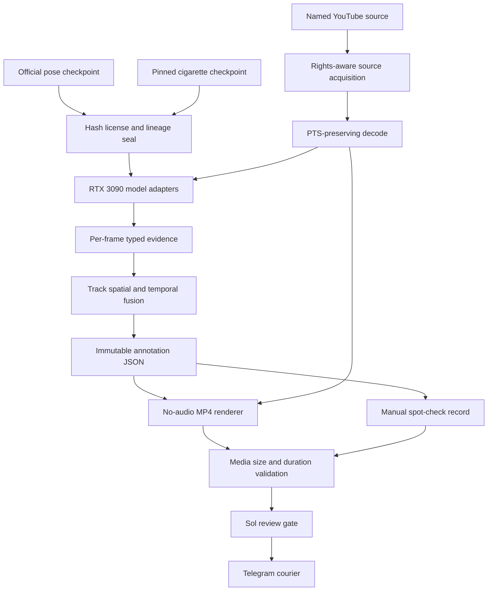
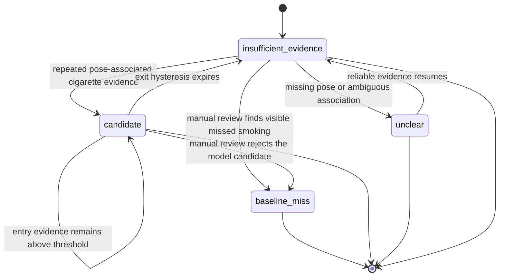

# Shibuya GPU Model Demo - Plan

## Goal Capsule

- **Objective:** The user can inspect a reproducible, honestly labelled smoking-candidate analysis of the specified Shibuya video and receive its annotated MP4 on their phone.
- **Means:** Run pinned person-pose and cigarette detectors on the local RTX 3090, combine spatial and temporal evidence, render an audit overlay, and deliver a sub-50 MB private artifact (KTD1-KTD8).
- **Product authority:** `docs/draft.md` defines the product intent. `docs/plans/2026-08-24-0722-feat-mandatory-gpu-release-plan.md` defines the production GPU boundary. This plan owns only the bounded model-baseline demonstration.
- **Stop conditions:** Stop before inference if source acquisition, license disposition, artifact integrity, CUDA execution, or model loading cannot be proved. A zero-detection or visibly wrong result is delivered as a failed baseline evaluation, not relabelled as success.
- **Execution profile:** Luna agents implement ticket-owned units in isolated GitFlow worktrees. Sol owns interface acceptance, integration review, and final code/document review.
- **Tail owner:** The parent orchestrator owns `ce-work`, `ce-code-review`, remote branch updates, physical GPU execution, and Telegram delivery.

---

## Product Contract

### Summary

Land a real downloadable model baseline, run it on the RTX 3090 against the user-selected Shibuya clip, and produce synchronized visual and JSON evidence.
The result is a private baseline demo and must not claim production accuracy or GPU production qualification.

### Problem Frame

The repository contains a mature deterministic policy core and a GPU software factory, but its checked-in model repository deliberately has unresolved weights, hashes, licenses, and engine files.
Existing fake providers and contract fixtures prove safety behavior but cannot answer whether the Shibuya clip contains detectable smoking evidence.

The requested clip is a 42-second public YouTube video titled `Smoking areas in Shibuya Tokyo Japan`, uploaded by `4kocool` under video ID `GByZa0qbA8A`.
The current local `yt-dlp` can read metadata but receives YouTube precondition errors for playable formats, and the page exposes no explicit reusable license in the retrieved metadata.
The implementation must therefore establish both an authorized private source receipt and a real GPU inference receipt before it can render or deliver a result.

### Key Decisions

- **Treat the result as a smoking candidate overlay, not ground truth.** Governs R6-R9.
- **Use an open-terms baseline with full ancestry disclosure.** Governs R2-R4.
- **Keep source media, weights, engines, and annotated media outside Git.** Governs R3, R10, R11.
- **Deliver even a negative or failed baseline result honestly.** Governs R8-R10.
- **Preserve shadow-only safety.** This demo cannot invoke the audio path. Governs R8 and R11.

### Actors

- A1. **User:** Supplies the target URL, receives the annotated artifact, and understands that the overlay is a baseline result.
- A2. **Luna implementation agent:** Claims one ticket, changes only owned files, and records verification and blockers.
- A3. **Sol technical lead/reviewer:** Accepts shared contracts, reviews integration, and rejects unsupported model or qualification claims.
- A4. **GPU demo runtime:** Decodes the private local clip, executes pinned models on the RTX 3090, and emits typed evidence.
- A5. **Manual reviewer:** Spot-checks model candidates and visible misses against the original frames.
- A6. **Telegram courier:** Delivers an existing file below 50 MB to the configured recipient and never creates or converts it.

### Requirements

**Source and model provenance**

- R1. The only target clip is `https://www.youtube.com/watch?v=GByZa0qbA8A`; acquisition must record video ID, title, uploader, duration, dimensions, source metadata, byte size, SHA-256, acquisition tool/version, and the user's private-evaluation direction.
- R2. The person-pose role must use a pinned official YOLO11 pose checkpoint, and the cigarette role must use `HEIher/smoking-detection` at commit `12a54cda2ca031e2b96a486bc288e957e56f51c8` unless its integrity or license gate rejects it.
- R3. Every downloaded model, export, runtime package, configuration, source clip, and output must have an exact SHA-256 and immutable lineage receipt; no floating `main`, unchecked redirect, or unrecorded auto-download may execute.
- R4. The license receipt must preserve the smoking model card's MIT statement, the parent YOLO11 AGPL-3.0 or Enterprise terms, the official pose-model terms, dataset ancestry gaps, and the private-demo disposition. Missing or incompatible terms block execution rather than being inferred from a model-card tag.

**GPU evidence and temporal behavior**

- R5. At least the person-pose and cigarette roles must execute real CUDA kernels on the local RTX 3090, and the run receipt must record GPU, driver, CUDA, framework, device placement, model hashes, processed frames, elapsed time, peak VRAM, and absence of a fake provider.
- R6. Each frame must preserve person boxes, pose keypoints and confidence, cigarette boxes and confidence, spatial association, track identity, source PTS, and bounded reason codes without model prose.
- R7. Temporal fusion must use source timestamps and deterministic track state to require repeated spatially associated evidence with hysteresis; it must distinguish `candidate`, `insufficient_evidence`, `unclear`, and `baseline_miss` without creating a production `verified` decision.

**Outputs, review, and delivery**

- R8. The annotated MP4 must show model/run revisions, GPU badge, timestamp, track ID, person and cigarette boxes, pose landmarks, per-role scores, temporal state, and a persistent `BASELINE DEMO - NOT PRODUCTION QUALIFIED` banner; it must contain no audio.
- R9. The JSON output must validate against a versioned schema and contain run provenance, thresholds, per-track evidence, event intervals, negative/unclear outcomes, and manual-review annotations while excluding source URLs with credentials, absolute host paths, raw pixels, and arbitrary model text.
- R10. A manual reviewer must inspect fixed time samples plus every event start, peak, and end, record true-candidate, false-candidate, visible-miss, or unclear judgments, and reconcile the review with the delivered JSON without rewriting raw model output.
- R11. The final MP4 must be playable, preserve source duration within one frame, remain below 50 MB, and be sent through the configured Telegram courier with a delivery receipt. If delivery fails, preserve the output and report the courier's exact recovery instruction.

**Factory execution**

- R12. Work must use `feature/DEMO-*` branches and isolated worktrees from remote `develop`, keep shared files under one integration owner, push accepted commits to the remote, and record each ticket plus material learning under `docs/dev_artifacts/`.

### Key Flows

- F1. **Acquire and seal source/model inputs**
  - **Trigger:** A2 starts DEMO-200 with network access in the staging workflow.
  - **Actors:** A2, A3.
  - **Steps:** Resolve immutable revisions, inspect terms, download outside Git, hash bytes, scan the pickle-based checkpoint, and write metadata-only receipts.
  - **Outcome:** Inputs are either approved for this private demo or the run stops with a named blocker under R1-R4.
- F2. **Run GPU evidence extraction**
  - **Trigger:** F1 has approved receipts and CUDA is available.
  - **Actors:** A2, A4.
  - **Steps:** Decode by source PTS, run both roles on CUDA, associate evidence to tracks, update deterministic temporal state, and write an atomic JSON run result.
  - **Outcome:** Every processed frame and event is bound to the exact runtime and artifacts under R5-R7.
- F3. **Render and manually review**
  - **Trigger:** F2 produces a valid JSON result.
  - **Actors:** A4, A5.
  - **Steps:** Render from source plus JSON, validate media properties, inspect the fixed/event samples, and append manual judgments to a separate review section.
  - **Outcome:** The MP4 and JSON explain detections, misses, and uncertainty under R8-R10.
- F4. **Deliver privately**
  - **Trigger:** Sol accepts the review, the MP4 is below 50 MB, and the output receipt passes.
  - **Actors:** A1, A3, A6.
  - **Steps:** Check courier connectivity, send the MP4, optionally send the compact JSON/report, and record returned delivery text.
  - **Outcome:** A1 receives the artifact or gets a specific courier recovery path under R11.

### Acceptance Examples

- AE1. **Covers R1-R4.** Given the Hugging Face repository still advertises MIT but its YOLO11 parent is AGPL-3.0, when acquisition runs, then both terms and the pinned parent ancestry appear in the receipt and the model is not described as unconditionally MIT-only.
- AE2. **Covers R3-R5.** Given the smoking checkpoint is a pickle-based `.pt` file with a published expected SHA-256 of `0ef558d3cf049d0acbb3f2322bc9e4e53db1a107426e3669622176c30c054d82` and expected size 40,509,349 bytes, when bytes differ, then loading and export are blocked.
- AE3. **Covers R5.** Given PyTorch can see CUDA but either role executes on CPU, when the receipt is validated, then the run fails the real-GPU gate.
- AE4. **Covers R6-R8.** Given a cigarette box is not spatially associated with a visible person's face/hand zone or does not persist, when fusion runs, then the overlay shows raw evidence but no smoking candidate interval.
- AE5. **Covers R7-R10.** Given visible smoking is missed by the baseline, when manual review records it, then the JSON reports `baseline_miss` and the MP4 remains a failed-baseline artifact rather than receiving synthetic boxes.
- AE6. **Covers R8-R11.** Given the first render exceeds 50 MB or contains an audio stream, when delivery validation runs, then a deterministic no-audio transcode is required and the invalid file is not sent.
- AE7. **Covers R8 and R11.** Given any smoking-candidate event, when the demo finishes, then no production decision, audit audio eligibility, or physical audio request is created.

### Success Criteria

- One command can reproduce the same JSON event intervals from the same source/model/config hashes, subject only to documented GPU numerical tolerance.
- The receipt proves both inference roles ran on the RTX 3090 and reports peak VRAM and throughput.
- The output MP4 and JSON pass media/schema validation, manual spot-check reconciliation, and the sub-50 MB Telegram constraint.
- The final report states the number of model candidates, false candidates, visible misses, and unclear intervals without extrapolating an accuracy rate from one clip.
- An unfamiliar coding agent can rerun acquisition verification, inference, rendering, manual-review export, and delivery from checked-in documentation without obtaining private media or weights from Git.

### Scope Boundaries

**In scope**

- A one-video, real-RTX-3090 baseline using pinned pretrained pose and cigarette checkpoints.
- Deterministic spatial/temporal association, an annotated MP4, a machine-readable JSON result, manual spot-checking, and private Telegram delivery.
- ONNX and TensorRT export attempts when the pinned models and local runtime support numerically equivalent export.

**Deferred to Follow-Up Work**

- Site-data training, hard-negative calibration, SigLIP 2 crop-head training, DeepStream/Triton integration, multi-camera load testing, and production promotion remain owned by the mandatory GPU release plan.
- Replacing an acquisition-blocked model with a newly trained Apache-2.0 or enterprise-licensed model requires a new model-selection ticket and dataset/license review.

**Outside this product's identity**

- Face recognition, identity inference, public redistribution of the source or derivative video, microphone/audio analysis, cloud inference, punitive use, or automatic public audio.
- Claiming that a box proves smoking, that this clip measures production accuracy, or that an RTX 3090 demo satisfies the L40S-class production gate.

### Sources and Research

- `docs/plans/2026-08-24-0722-feat-mandatory-gpu-release-plan.md` defines the no-fake-provider, provenance, GPU receipt, and lab-versus-production boundaries.
- `ml/registry/model_repository.py`, `model-repository/manifest/model-release.json`, and `scripts/verify_model_artifacts.py` provide the fail-closed model acquisition and engine identity patterns.
- `src/tp_smoke_detect/domain/cascade/` provides source-time, retry-safe temporal-state patterns; the demo cannot reuse its production `verified` vocabulary.
- `docs/dev_artifacts/memory/2026-08-24-gpu-103-metadata-only-model-releases.md` and `docs/dev_artifacts/memory/2026-08-24-video-301-replay-boundaries.md` require metadata-only Git artifacts and root-relative deterministic replay.
- [HEIher smoking-detection model card](https://huggingface.co/HEIher/smoking-detection) identifies a YOLO11-medium single-class `cigarette` detector, a model-card MIT declaration, and Roboflow training ancestry.
- [Pinned Hugging Face revision](https://huggingface.co/HEIher/smoking-detection/tree/12a54cda2ca031e2b96a486bc288e957e56f51c8) provides the immutable candidate revision. The resolver publishes the expected `best.pt` SHA-256 and size used by AE2; implementation must verify the downloaded bytes.
- [Ultralytics YOLO11 documentation](https://docs.ultralytics.com/models/yolo11/) states that YOLO11 pose variants support inference/export and that YOLO11 models are offered under AGPL-3.0 or Enterprise terms.
- [Ultralytics export documentation](https://docs.ultralytics.com/modes/export/) documents ONNX and TensorRT export, but compatibility remains an execution-time parity gate.
- The local host reports RTX 3090 compute capability 8.6, driver 580.126.09, PyTorch 2.9.1+cu128, torchvision 0.24.1+cu128, CUDA availability, and no ONNX Runtime CUDA provider or TensorRT installation in the current Python environment.

---

## Planning Contract

### Key Technical Decisions

- KTD1. **Use YOLO11n-pose plus the pinned HEIher YOLO11m cigarette detector for the demonstration.** One runtime covers person boxes, 17-keypoint pose, and the custom cigarette class. This is the shortest path to a real GPU result while preserving separate role receipts. The custom detector is a weak external baseline, not the planned production SigLIP 2 head.
- KTD2. **Treat the effective demo dependency boundary as AGPL-3.0 unless a written enterprise disposition says otherwise.** The custom model card's MIT statement does not erase its declared YOLO11 parent terms. Keep the optional demo tooling isolated from the Apache-2.0 base install and ship the required notices/source offer with any redistributed demo bundle.
- KTD3. **Load the pickle checkpoint only inside a disposable, unprivileged conversion/runtime environment.** Verify revision, size, and SHA-256 before load; mount no credentials; remove network access after acquisition; and retain a software bill of materials. Export ONNX in that boundary and prefer ONNX/TensorRT for repeated execution only when fixed-frame parity passes. Direct PyTorch CUDA remains an acceptable private-demo fallback with a receipt, not a production path.
- KTD4. **Make source acquisition a rights-aware staging step.** Pin `yt-dlp`, record metadata and acquisition errors, and never substitute another Shibuya clip. Because the retrieved metadata contains no explicit reusable license, retain source and output as private user-directed evaluation artifacts and block public publication.
- KTD5. **Use deterministic track-local fusion rather than a frame-level smoking label.** Associate cigarette boxes to expanded head/hand zones, track people by stable tracker IDs, evaluate repeated evidence on source PTS, and use separate entry/exit thresholds. Raw detections remain visible even when fusion rejects an event.
- KTD6. **Define a demo-specific result schema.** Use `candidate`, `insufficient_evidence`, `unclear`, and `baseline_miss`; never emit `DecisionOutcome.VERIFIED`, populate the production audit repository, or call `CandidateProcessingService` or `AudioRequestService`.
- KTD7. **Render from immutable JSON evidence instead of drawing during inference.** A two-phase extract-then-render pipeline makes overlay changes repeatable without rerunning models and lets manual review reference stable frame/track/event IDs.
- KTD8. **Strip audio and size for courier delivery after evidence is frozen.** Render H.264/yuv420p at the source dimensions and frame rate. If the result is 50 MB or larger, reduce video bitrate or CRF without changing timestamps or JSON evidence, then revalidate duration and frames.
- KTD9. **Parallelize only after U1 freezes the demo contracts and dependency lock.** U2, U3, and U4 own disjoint modules/worktrees. U5 alone integrates their branches and produces physical-run artifacts. Sol reviews U1's trust boundary and U5's final diff before U6 sends anything.

### Assumptions

- The user-directed one-off private evaluation may use the selected AGPL-3.0/MIT model combination when notices and source obligations are preserved. This is an implementation assumption, not legal advice; a written rejection activates the R4 stop condition.
- The user has authority to request a private local copy of the named YouTube clip. No public or commercial redistribution is assumed.
- The source candidate is expected to decode as approximately 42 seconds at 640 by 480. U1 must record actual `ffprobe` properties and fail if it receives only storyboard images.
- Cigarettes are large enough in at least some frames for the custom detector or manual reviewer to assess. A miss is a valid baseline outcome.
- The existing Telegram courier is configured for the intended recipient and accepts MP4. U6 must treat its connection and response as execution-time evidence.

### High-Level Technical Design





### Interfaces and Artifact Layout

The extraction result is the single source of overlay truth. It owns source PTS, normalized boxes/keypoints, immutable role revisions, association scores, temporal states, event intervals, GPU receipt, and run/config hashes. Manual review is an append-only section or companion file keyed by stable event/frame IDs.

```text
ml/demo/
  contracts.py
  acquisition.py
  models.py
  fusion.py
  annotate.py
ml/configs/demo/
  shibuya-baseline.json
schemas/demo/
  video-annotation.v1.json
scripts/
  acquire_demo_assets.py
  annotate_video.py
  validate_demo_run.py
tests/unit/ml/demo/
tests/integration/demo/
tests/gpu/demo/
docs/runbooks/
  model-demo.md
docs/dev_artifacts/demo_runs/
docs/dev_artifacts/tickets/
docs/dev_artifacts/memory/
local_artifacts/model-demo/   # ignored: source, weights, exports, engines, output MP4
```

### Implementation Constraints

- Preserve the CPU-safe base install. Demo dependencies live in a dedicated optional group or digest-pinned image and are imported lazily.
- Preserve the existing v1 production contracts. The demo schema is new and cannot weaken `track.candidate.v1` or audio policy.
- Do not commit source or annotated video, model weights, ONNX files, TensorRT plans, tokens, cookies, absolute host paths, or sensitive screenshots.
- Require atomic JSON and MP4 publication. A partial or failed run remains in a temporary run directory and cannot be delivered.
- Use bounded labels and reason enums in metrics and JSON. Track IDs may appear inside the private JSON/overlay but not as Prometheus labels.
- Freeze thresholds before the Shibuya run. Manual review may annotate errors but cannot tune and rerun against the same clip without recording a new config/run revision.

### Sequencing and Parallel Luna Allocation

| Wave | Unit/ticket | Branch and worktree | Owner | Dependency | Exclusive ownership |
|---|---|---|---|---|---|
| 0 | U1 / DEMO-200 | `feature/DEMO-200-demo-contracts` / `.worktrees/feature/DEMO-200-demo-contracts` | Luna, Sol acceptance | remote `develop` | Demo contracts, acquisition, config, dependency lock, ignore rules, model/source receipts |
| 1 | U2 / DEMO-201 | `feature/DEMO-201-gpu-models` / `.worktrees/feature/DEMO-201-gpu-models` | Luna | U1 | GPU adapters, conversion/export, adapter and GPU tests |
| 1 | U3 / DEMO-202 | `feature/DEMO-202-fusion` / `.worktrees/feature/DEMO-202-fusion` | Luna | U1 | Spatial association, temporal state, unit tests |
| 1 | U4 / DEMO-203 | `feature/DEMO-203-annotator` / `.worktrees/feature/DEMO-203-annotator` | Luna | U1 | Renderer, script interface, schemas, fixture-based integration tests |
| 2 | U5 / DEMO-204 | `feature/DEMO-204-shibuya-integration` / `.worktrees/feature/DEMO-204-shibuya-integration` | Integration Luna, Sol review | U2-U4 | Merge conflict resolution, real RTX run, runbook, e2e qualification, manual-review packet |
| 3 | U6 / DEMO-205 | same accepted integration worktree | Root/operations owner | U5 and Sol PASS | Delivery receipt and final progress/memory artifacts only |

No two Wave 1 agents edit `pyproject.toml`, `uv.lock`, `.gitignore`, shared demo contracts, or the same ticket file. U1 owns those shared surfaces before Wave 1 branches are cut. U5 is the only integration authority and reruns every authoritative gate on the integrated tree.

### Risks and Mitigations

| Risk | Mitigation |
|---|---|
| Model card license overstates freedom relative to YOLO11 ancestry | Record MIT plus AGPL/Enterprise ancestry, isolate the demo component, and stop without a usable written disposition. |
| `.pt` weight executes pickle content | Verify the pinned hash/size, load without secrets or egress in an unprivileged environment, scan dependencies, then prefer a parity-tested non-pickle export. |
| YouTube extraction returns only storyboards | Pin/update acquisition tooling, validate a playable 42-second video stream with `ffprobe`, and never infer success from metadata-only extraction. |
| Tiny cigarettes are below 640-by-480 visibility | Preserve raw confidence and visible misses, use hand/face region association, and report baseline failure without fabricating evidence. |
| Pose tracking changes IDs or loses occluded people | Use source-time gaps, deterministic association configuration, and `unclear` state; manual review checks event boundaries and identity switches. |
| ONNX/TensorRT export changes detections | Compare fixed frames against the pinned PyTorch baseline and reject the export when box/class/keypoint tolerance fails. |
| One clip encourages an accuracy claim | Report counts and examples only; no accuracy percentage, production qualification, or threshold tuning on the reviewed clip. |
| Output leaks audio or exceeds courier limits | Strip audio, validate stream inventory and duration, transcode below 50 MB, and check the exact file before courier submission. |

---

## Implementation Units

### U1. Seal demo contracts and acquire approved inputs (DEMO-200)

- **Goal:** Freeze the demo result/source/model contracts and produce verified local input receipts before any model is loaded.
- **Requirements:** R1-R4, R9, R11, R12; F1; AE1, AE2.
- **Dependencies:** Existing `ml/registry/model_repository.py` and remote `develop`.
- **Files:** `ml/demo/contracts.py`, `ml/demo/acquisition.py`, `ml/configs/demo/shibuya-baseline.json`, `scripts/acquire_demo_assets.py`, `schemas/demo/video-annotation.v1.json`, `pyproject.toml`, `uv.lock`, `.gitignore`, `tests/unit/ml/demo/test_acquisition.py`, `tests/contract/test_demo_schema.py`, `docs/dev_artifacts/tickets/DEMO-200.md`, `docs/dev_artifacts/qualification/model-demo/`.
- **Approach:**
  1. Define strict metadata-only source, model, runtime, frame-evidence, event, manual-review, and delivery receipts.
  2. Reuse the existing HTTPS, path-containment, exact-size, SHA-256, license-disposition, and atomic-write patterns.
  3. Resolve the official pose checkpoint and pinned smoking revision without floating downloads. Verify AE2 before any pickle load.
  4. Put optional GPU/media dependencies in an isolated group. Keep all large/generated bytes under the ignored local artifact root.
- **Execution note:** Start with failing receipt tests for a changed weight, a storyboard-only source, a floating revision, missing ancestry, and a path escape.
- **Patterns to follow:** `ml/registry/model_repository.py`, `scripts/verify_model_artifacts.py`, `ml/datasets/manifest.py`, `src/tp_smoke_detect/adapters/artifacts/local.py`.
- **Test scenarios:**
  - Given the pinned HEIher revision, expected size, and expected hash, acquisition records identical local bytes and both MIT and YOLO11 parent terms.
  - Given a redirect to a different revision, changed byte, wrong size, HTTP source, unknown license, or executable file outside the allowlist, acquisition stops before model load.
  - Given current `yt-dlp` returns only storyboard images, source validation fails and does not write an approved video receipt.
  - Given a playable clip, `ffprobe` metadata, content hash, video ID, uploader, tool version, and private-use disposition are stable across validation runs.
  - Given an absolute path, symlink escape, credential-bearing URL, cookie content, or raw media in a would-be committed receipt, validation rejects or redacts it.
- **Verification:** Contract and acquisition tests pass without network or GPU; the checked-in manifest is metadata-only; local approved receipts bind exact bytes and terms; Sol accepts the trust boundary before Wave 1 starts.

### U2. Implement real CUDA model adapters and export parity (DEMO-201)

- **Goal:** Execute the two pinned inference roles on RTX 3090 and expose typed, revision-bound results to the demo pipeline.
- **Requirements:** R2-R6, R12; F2; AE2, AE3.
- **Dependencies:** U1.
- **Files:** `ml/demo/models.py`, `ml/demo/export.py`, `scripts/validate_demo_run.py`, `tests/unit/ml/demo/test_model_adapters.py`, `tests/gpu/demo/test_cuda_models.py`, `tests/gpu/demo/test_export_parity.py`, `docs/dev_artifacts/tickets/DEMO-201.md`, `docs/dev_artifacts/qualification/model-demo/`.
- **Approach:**
  1. Add lazy adapters for the pose and cigarette roles with explicit CUDA device placement, fixed preprocessing, bounded batches, and typed outputs.
  2. Capture warm-up, processed-frame count, throughput, peak VRAM, CUDA/runtime identities, and exact artifact/config hashes.
  3. Convert inside the isolated U1 boundary. Compare fixed approved frames before accepting ONNX or TensorRT.
  4. Prefer TensorRT only when the local runtime is installed and parity passes. Preserve the PyTorch CUDA adapter as the qualified private-demo fallback.
- **Execution note:** Prove one real frame on each CUDA adapter before optimizing or exporting.
- **Patterns to follow:** `src/tp_smoke_detect/adapters/inference/onnx.py`, `src/tp_smoke_detect/ports/inference.py`, `ml/registry/model_repository.py`, `tests/gpu/test_one_stream.py`.
- **Test scenarios:**
  - Given a fixed frame and approved weights, each adapter returns normalized bounded boxes/keypoints and the exact role/model revision.
  - Given CPU placement, CUDA unavailable, mixed device tensors, OOM, malformed output, or model-revision mismatch, the adapter returns a failed role receipt and no positive evidence.
  - Given repeated inference on the same frame and config, output ordering and typed values remain deterministic within documented floating-point tolerance.
  - Given ONNX or TensorRT output outside the accepted box IoU, confidence, class, or keypoint tolerance, the export is rejected and cannot appear in the final run manifest.
  - Given both roles execute on CUDA, the receipt names RTX 3090, driver, CUDA, framework, hashes, frames, elapsed time, and peak VRAM without claiming production qualification.
- **Verification:** Unit tests remain CPU-safe; opt-in GPU tests prove both roles execute on device 0; accepted exports have byte and parity receipts; no fake provider or unverified engine can satisfy the run gate.

### U3. Implement deterministic spatial and temporal fusion (DEMO-202)

- **Goal:** Convert per-frame pose and cigarette evidence into auditable candidate intervals without using production `verified` semantics.
- **Requirements:** R6, R7, R9, R12; F2; AE4, AE5.
- **Dependencies:** U1.
- **Files:** `ml/demo/fusion.py`, `tests/unit/ml/demo/test_spatial_association.py`, `tests/unit/ml/demo/test_temporal_fusion.py`, `docs/dev_artifacts/tickets/DEMO-202.md`, `docs/dev_artifacts/memory/`.
- **Approach:**
  1. Match cigarette boxes only to a tracked person's expanded head or wrist-to-mouth zone using normalized geometry and deterministic tie-breaking.
  2. Advance state from source PTS with separate entry, persistence, gap, and exit thresholds stored in the hashed config.
  3. Retain raw detections and bounded rejection reasons for unmatched, low-confidence, occluded, or identity-switch frames.
  4. Emit stable event IDs from source/model/config/track/time identities and preserve manual-review corrections separately.
- **Execution note:** Implement the state-transition and timestamp boundary tests before integrating real model output.
- **Patterns to follow:** `src/tp_smoke_detect/domain/cascade/cycle.py`, `src/tp_smoke_detect/domain/cascade/track.py`, `src/tp_smoke_detect/domain/policy/evidence.py`.
- **Test scenarios:**
  - Given repeated high-confidence cigarette boxes inside one person's face/hand zone, fusion enters one candidate interval only after the configured persistence threshold.
  - Given a cigarette box nearer to another person, overlapping people, equal association scores, or a tracker ID switch, deterministic tie-breaking prevents evidence from being counted for both tracks.
  - Given isolated positive frames, out-of-order PTS, a gap, missing pose, low coverage, or boxes outside the association zone, no candidate interval is created and the reason is preserved.
  - Given a candidate followed by brief absence, hysteresis keeps one interval; given absence beyond the exit threshold, the interval closes at the source timestamp.
  - Given identical typed frames in two runs, event IDs, intervals, states, and JSON ordering are byte-equivalent.
- **Verification:** Pure unit tests cover every state edge and geometry boundary; no wall clock, GPU, raw pixels, production audit, or audio dependency enters the fusion module.

### U4. Build the reproducible annotation renderer and CLI (DEMO-203)

- **Goal:** Extract immutable evidence, render a synchronized no-audio overlay, and validate the demo result through one documented interface.
- **Requirements:** R6-R12; F2, F3; AE4-AE7.
- **Dependencies:** U1; use fixture adapters until U2 and U3 integrate.
- **Files:** `ml/demo/annotate.py`, `scripts/annotate_video.py`, `scripts/validate_demo_run.py`, `docs/runbooks/model-demo.md`, `tests/integration/demo/test_annotation_pipeline.py`, `tests/integration/demo/test_media_validation.py`, `docs/dev_artifacts/tickets/DEMO-203.md`.
- **Approach:**
  1. Separate extraction, fusion, rendering, manual-review import, and validation phases behind the same run directory and manifest.
  2. Decode and encode with source PTS, retain source dimensions/frame rate, strip audio, and publish JSON/MP4 atomically.
  3. Render every R8 field from the frozen JSON, including rejected evidence and the permanent baseline banner.
  4. Validate schema, duration, frame count, stream inventory, size, hashes, and consistency between event intervals and displayed overlays.
- **Execution note:** Use synthetic redistributable frames and fake typed adapter outputs first; real model execution belongs to U5.
- **Patterns to follow:** `scripts/replay_fixture.py`, `src/tp_smoke_detect/application/replay.py`, `tests/integration/test_replay_candidate_flow.py`, `scripts/gpu_receipts.py`.
- **Test scenarios:**
  - Given a synthetic input and typed fixture evidence, extraction writes schema-valid JSON and rendering produces a playable no-audio MP4 with the expected overlays.
  - Given no detections, the renderer shows the GPU/revision/banner and produces an empty event list rather than failing or inventing an event.
  - Given malformed JSON, a source hash mismatch, out-of-range box, missing role receipt, partial file, or event outside source duration, validation rejects the run.
  - Given a candidate, insufficient-evidence, unclear, and manually tagged baseline-miss interval, each state has a distinct bounded overlay and matching JSON entry.
  - Given an oversized render, the delivery transcode preserves duration, frame timing, event alignment, no-audio state, and JSON hash linkage.
- **Verification:** Fixture-based integration tests prove deterministic extraction/render separation, schema/media validation, atomic outputs, and sub-50 MB remediation without requiring private media or GPU in normal CI.

### U5. Integrate and run the Shibuya RTX 3090 baseline (DEMO-204)

- **Goal:** Merge the accepted model, fusion, and renderer lanes, execute the named clip on RTX 3090, and produce reviewable artifacts.
- **Requirements:** R1-R12; F1-F3; AE1-AE7; all success criteria.
- **Dependencies:** U2, U3, U4 accepted and merged into the integration worktree.
- **Files:** `tests/e2e/test_shibuya_demo.py`, `docs/runbooks/model-demo.md`, `docs/dev_artifacts/demo_runs/<run-id>/manifest.json`, `docs/dev_artifacts/demo_runs/<run-id>/manual-review.json`, `docs/dev_artifacts/demo_runs/<run-id>/report.md`, `docs/dev_artifacts/tickets/DEMO-204.md`, `docs/dev_artifacts/memory/`, `AGENTS.md`.
- **Approach:**
  1. Run authoritative CPU and demo gates on the integrated tree, then perform one sealed extraction with the frozen source/model/config hashes.
  2. Render from the sealed JSON, validate the media, and perform the R10 sampling protocol without changing thresholds.
  3. Record candidate counts, false candidates, visible misses, unclear intervals, GPU evidence, export backend, media properties, and all known limitations.
  4. Keep the source, weights, exports, engine, and MP4 under the ignored local artifact root. Commit only redacted metadata receipts, tickets, runbook updates, and non-identifying reports.
- **Execution note:** This is smoke-first integration. A model miss, zero-event result, or failed export remains evidence and must not be repaired by relabelling or threshold tuning on the reviewed clip.
- **Patterns to follow:** `tests/e2e/test_gpu_vertical_slice.py`, `scripts/qualify_gpu.py`, `docs/dev_artifacts/qualification/`, `AGENTS.md`.
- **Test scenarios:**
  - Given the approved Shibuya clip and artifacts, one end-to-end run proves two real CUDA roles and produces source/model/config-bound JSON plus a no-audio MP4.
  - Given an acquisition, GPU, artifact, model, export, decode, render, or schema failure, the run is labelled failed and no final MP4 is published or sent.
  - Given manual review disagrees with model output, the raw event remains immutable and the separate judgment records false-candidate, visible-miss, or unclear with source timestamps.
  - Given a second run with the same inputs, event intervals and JSON are equal within the documented GPU tolerance; changed thresholds create a new run/config revision.
  - Given the final report, a reviewer can distinguish this baseline demo from DeepStream/Triton, site-quality, 20-stream, and production qualification.
- **Verification:** The integrated CPU/demo/GPU/e2e gates pass; the final report and receipts reconcile; Sol's code/document review has no unresolved P0/P1; every accepted branch and integration commit is on the remote.

### U6. Validate and deliver the accepted artifacts (DEMO-205)

- **Goal:** Send the exact accepted MP4 to the user's configured Telegram chat and preserve an auditable delivery receipt.
- **Requirements:** R8-R12; F4; AE6, AE7.
- **Dependencies:** U5 and Sol review PASS.
- **Files:** `docs/dev_artifacts/demo_runs/<run-id>/delivery.json`, `docs/dev_artifacts/tickets/DEMO-205.md`, `docs/dev_artifacts/progress/`.
- **Approach:**
  1. Revalidate the accepted file hash, path containment, MP4 stream inventory, duration, and size immediately before courier use.
  2. Check the configured courier connection and submit the existing MP4 path. Do not copy files through `/tmp` or ask for a different recipient.
  3. Treat a response beginning with `Failed` as a failed delivery, preserve the file, and record the named remediation. On success, record the exact response, timestamp, file hash, and byte size.
- **Execution note:** This unit changes no model result or video content. It sends only the artifact accepted by U5 and Sol.
- **Patterns to follow:** Root `AGENTS.md` Telegram delivery instructions and the courier's returned status text.
- **Test scenarios:**
  - Given a connected courier and an accepted MP4 below 50 MB, the exact hash-bound file is submitted and the success receipt is stored.
  - Given the courier is missing, disconnected, rejects the extension, cannot see the path, or reports a size failure, the unit records failure and remediation without claiming phone delivery.
  - Given the file changed after Sol review, pre-delivery hash validation blocks sending.
- **Verification:** The user receives the MP4 and the stored receipt matches its accepted hash, or the preserved artifact and exact courier recovery path are reported without a false success claim.

---

## Verification Contract

| Gate | Command or procedure | Required evidence |
|---|---|---|
| Base formatting and lint | `uv run ruff format --check .` and `uv run ruff check .` | No regression in CPU-safe code. |
| Base typing and tests | `uv run mypy src ml tests` and `uv run pytest tests/unit tests/contract tests/integration` | Existing safety contracts and new demo contracts remain green. |
| Demo fixture path | `uv run pytest tests/unit/ml/demo tests/integration/demo` | Acquisition validation, fusion, rendering, media validation, and failure paths pass without private inputs. |
| Schema | Validate the frozen run JSON against `schemas/demo/video-annotation.v1.json` | Schema, hashes, role revisions, events, manual review, and delivery linkage are complete. |
| Source | Run `ffprobe` and SHA-256 validation against the approved source receipt | Playable video rather than storyboard; exact duration, dimensions, streams, frame rate, byte size, and content hash. |
| Real GPU roles | Opt-in `tests/gpu/demo/` plus the U5 extraction | Both roles execute on RTX 3090; no fake provider; runtime and peak-VRAM receipt present. |
| Export parity | Compare pinned PyTorch, ONNX, and TensorRT outputs on approved fixed frames when the latter backends exist | Only parity-passing exports appear in the final run manifest; an unavailable or failed export is explicit. |
| End-to-end result | `tests/e2e/test_shibuya_demo.py` against the sealed U5 run | JSON, MP4, source/model/config hashes, event intervals, and manual review reconcile. |
| Media delivery | `ffprobe`, size check, file hash, and courier connection/submission receipt | H.264/yuv420p MP4, no audio, duration within one frame, below 50 MB, exact accepted bytes sent. |
| Repository hygiene | Git status plus secret/media/model allowlist scan | No source video, annotated MP4, weights, exports, engines, cookies, tokens, private paths, or identifying screenshots in Git. |
| Review | Sol `ce-code-review` on the integrated feature branch | No unresolved P0/P1 and all residual P2 items named before delivery. |

Manual review samples every two seconds, plus each event's first positive frame, peak-confidence frame, final positive frame, and the first frame after exit. The reviewer also scans the entire short clip at normal speed for visible missed smoking. The review records timestamp, track/event ID when present, judgment, visibility, and a bounded reason. It does not add synthetic model detections or change thresholds.

---

## Definition of Done

- U1 records a playable source receipt and exact approved model/license/lineage receipts, including the HEIher revision, 40,509,349-byte size, expected SHA-256, pickle warning, and YOLO11 parent terms.
- U2 proves both model roles run on the RTX 3090 and records exact runtime, artifacts, GPU, throughput, and peak VRAM. ONNX/TensorRT are used only after parity evidence.
- U3 produces deterministic source-time candidate intervals and explicit insufficient, unclear, and baseline-miss paths without production `verified` or audio semantics.
- U4 produces schema-valid JSON and a synchronized, no-audio, baseline-labelled MP4 from frozen evidence and handles the 50 MB limit.
- U5 runs the named Shibuya clip once with frozen thresholds, completes manual review, reports detections and misses honestly, and pushes the accepted integration branch and metadata artifacts.
- Sol completes final code/document review with no unresolved P0/P1 finding and confirms the baseline-versus-production boundary.
- U6 sends the exact accepted MP4 to Telegram and records a success receipt, or reports the preserved file plus exact delivery blocker without claiming success.
- CPU-safe installs and all existing unit, contract, integration, schema, native, Compose, and safety gates remain green where touched.
- Every ticket has a result artifact. Every material model, acquisition, CUDA, export, rendering, or courier problem has a reusable memory note.
- Generated weights, exports, engines, source media, annotated media, cookies, secrets, dead-end experiments, and temporary run directories are absent from the final Git diff.
