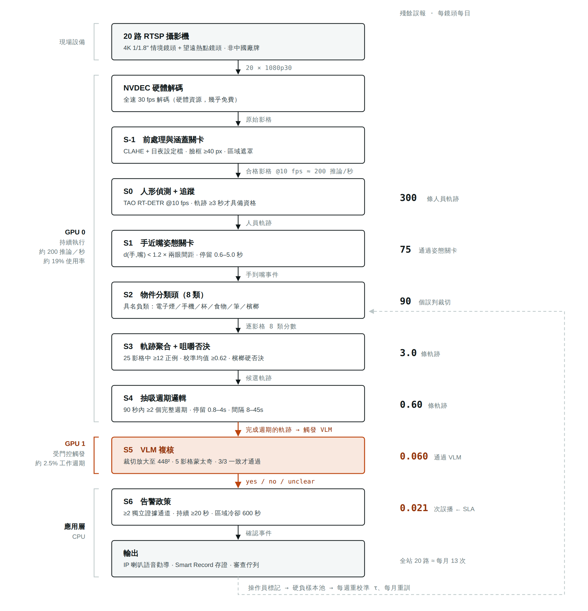
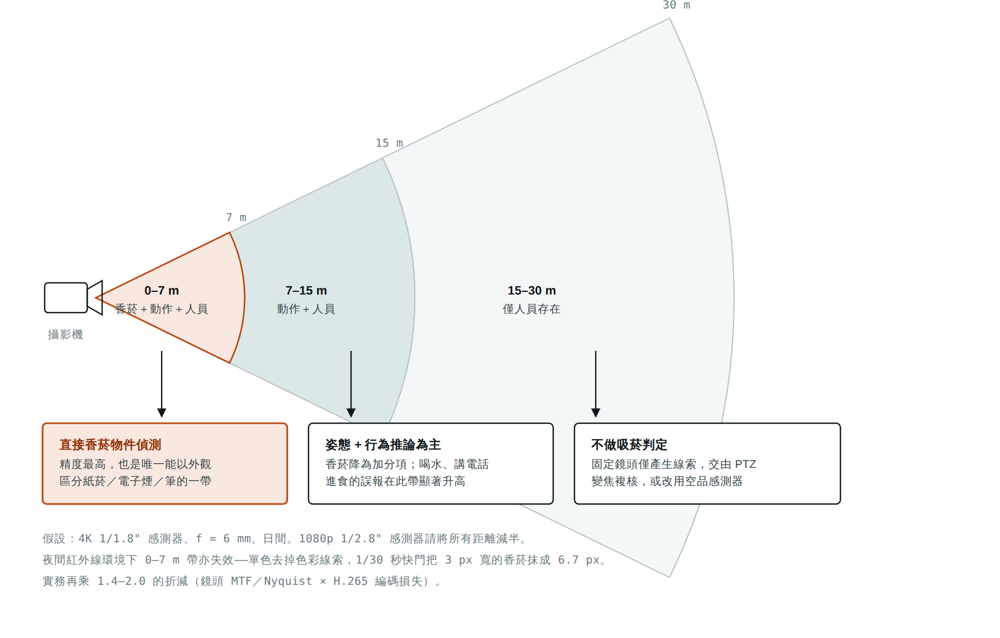
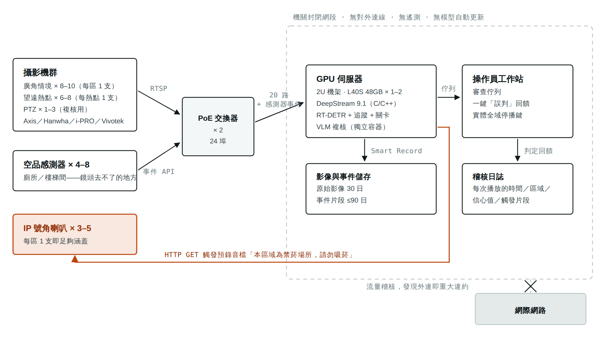
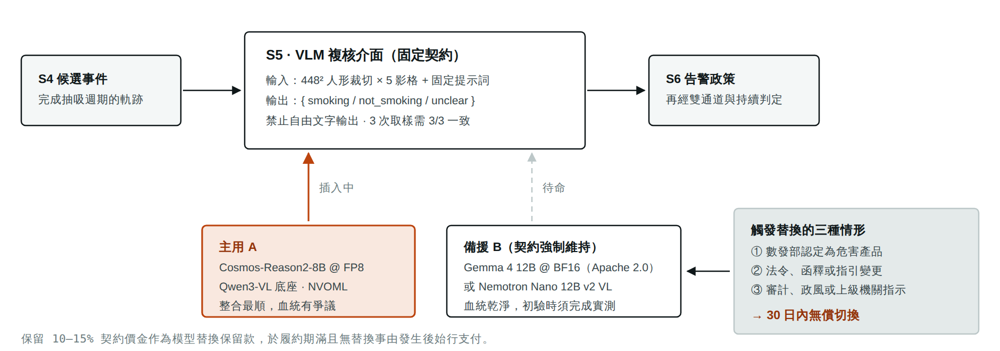

# 吸菸偵測系統架構圖

*地端吸菸偵測 · 系統架構圖 · 2026-08*

四張圖，對應四個必須被理解的機制：資料在管線裡如何一層層變少、光學上哪些距離根本不可能、實體與網路邊界怎麼畫、以及模型被判定為危害產品時系統如何存活。

## 圖 1 · 兩段速率管線

整套系統能用一張 GPU 做到近即時，是因為**便宜的 CV 跑滿每一路每一秒，昂貴的 VLM 幾乎全時閒置**。右欄是每一關之後還活著的誤報數量——這個數字才是專案的成敗，而它是被時序邏輯壓下去的，不是被更好的模型壓下去的。

*向量原稿：[figures/fig1.svg](figures/fig1.svg)*

> **怎麼讀：**左欄是執行位置與成本，中間是關卡，右欄是還活著的誤報。注意 S5 那一格——它是唯一在第二張 GPU 上、唯一被門控、也是唯一每小時只跑幾次的一關。**每一關必須因不同原因失敗**：姿態關卡擋掉挖鼻孔、具名負類擋掉手機與飲料、咀嚼否決擋掉檳榔、抽吸週期擋掉牙籤與未點燃的菸、VLM 擋掉前面都沒想到的情境。都用同一種線索堆多層閾值，等於沒有級聯。

## 圖 2 · 能看見什麼，取決於距離

同一支鏡頭，三個同心的能力範圍。**可以直接偵測到香菸的扇形，只是可以偵測手到嘴動作的扇形的一小塊子集**——這就是為什麼動作必須是主訊號，而香菸偵測只能當加分項。

*向量原稿：[figures/fig2.svg](figures/fig2.svg)*

> **可對外承諾的規格：**「日間，鏡頭 0–7 公尺內可靠偵測吸菸行為；至約 15 公尺為機率性行為推論；15 公尺以上不在未加設 PTZ 或增設鏡頭的情況下作任何偵測承諾。」超過這個範圍的承諾都會在驗收或議會上出事。**超解析度／AI 影像增強不會創造資訊**——它只是幻覺出合理的紋理，放在偵測器上游會產生「有信心的錯誤」，在證據上完全不可採。

## 圖 3 · 實體部署與網路邊界

語音是**唯一會離開系統的輸出**，而它走的是一條從 GPU 伺服器繞回現場喇叭的回授路徑。整條鏈路都在封閉網段內，對外零連線——這一點同時是資安要求、個資設計，也是議會答詢時的防禦工事。

*向量原稿：[figures/fig3.svg](figures/fig3.svg)*

> **三個設計決定藏在這張圖裡。**其一，**不採購麥克風**——系統只需要音訊輸出，不需要輸入，這避開刑法第 315-1 條與通保法。其二，儲存分成三個不同的保存時鐘（原始影像／事件片段／不含影像的中繼資料），而不是一個。其三，**操作員工作站上有一個實體全域停播鍵**，機關可以在不需要廠商協助的情況下立即關掉語音——這一條要寫進契約。

## 圖 4 · S5 是一個插槽，不是一個模型

因為「美廠微調的陸源模型算不算大陸廠牌」在台灣是**規範空白**，而《審查辦法》第 7 條讓本案**沒有「專案方式使用」這條退路**（要求不得對不特定人播放聲音），所以架構上必須把模型做成可抽換的零件。這張圖畫的是契約條款的技術對應物。

*向量原稿：[figures/fig4.svg](figures/fig4.svg)*

> **為什麼這個設計是必要的：**若模型日後被認定為危害產品，《資通安全管理法》第 11 條的「專案方式使用」例外要求「指定特定區域及特定人員使用，**且不得傳播影像或聲音，供不特定人士直接收視或收聽**」——一套對公共區域播放語音勸導的系統本質上就不符合。也就是說**結局只有「非危害產品」或「整套下架」兩種，而且第 6 條要求的是「立即」停用，沒有緩衝期**。把 S5 做成插槽，是把「專案死亡」降級為「30 天內換模型」的唯一方法。相對地，規格書也應寫成能力導向（「Recall ≥○○%、誤報 ≤○○ 件/鏡頭/日」），不指定模型名稱，這樣換模型就不是設計變更。

---

本頁為《地端吸菸偵測方案評估》的圖解附件，數值與依據見該報告正文。圖 1 的誤報推演為模型化估計（假設每日 12 小時、5 fps、約 300 條人員軌跡、約 5 次真實吸菸事件），實際值必須以八週靜默期的現地量測取代。圖 2 的距離為理論光學值，已於圖內註明折減係數。
